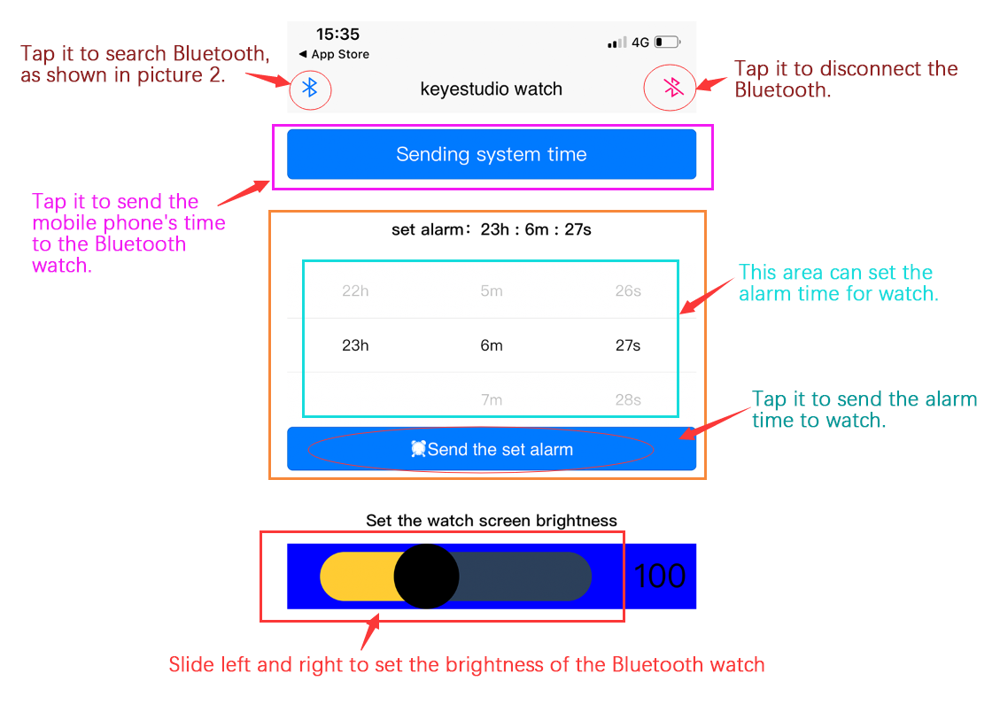
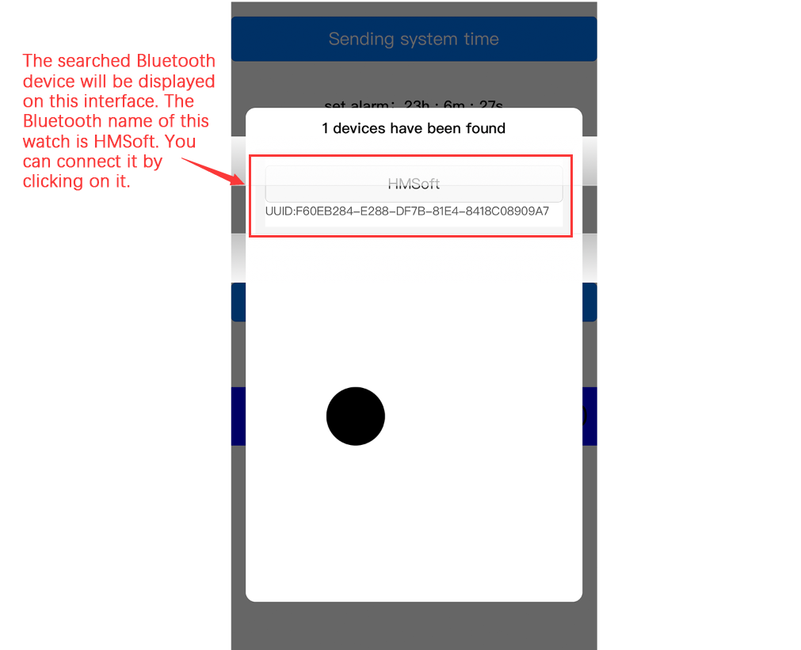
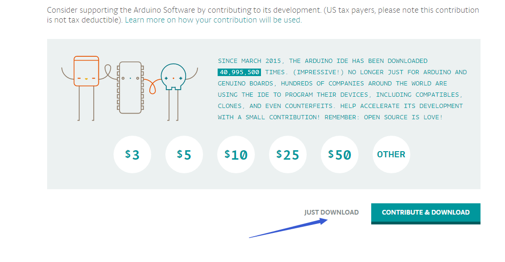
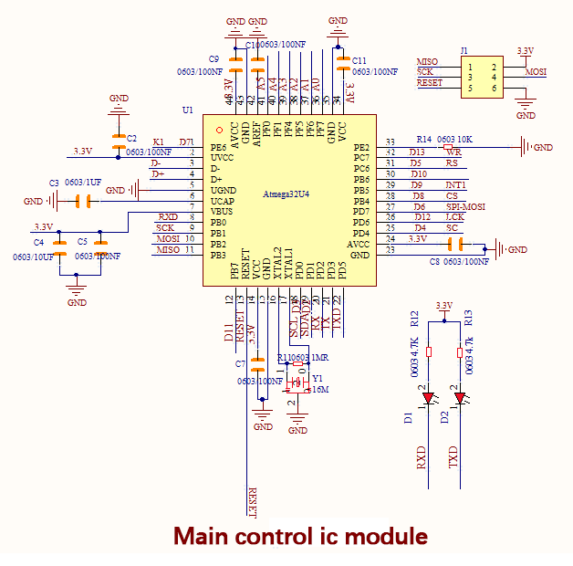
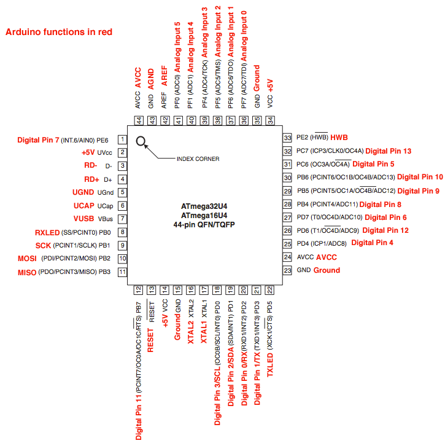
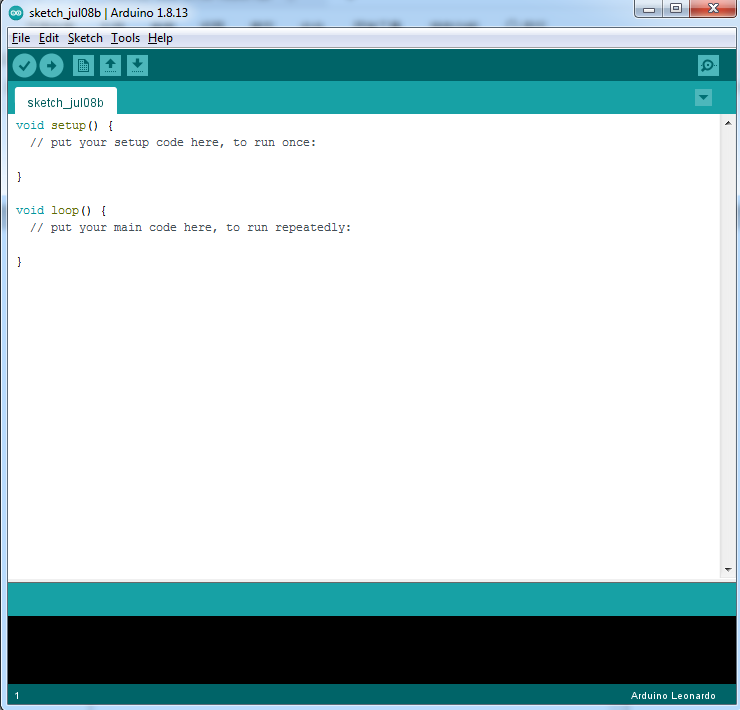
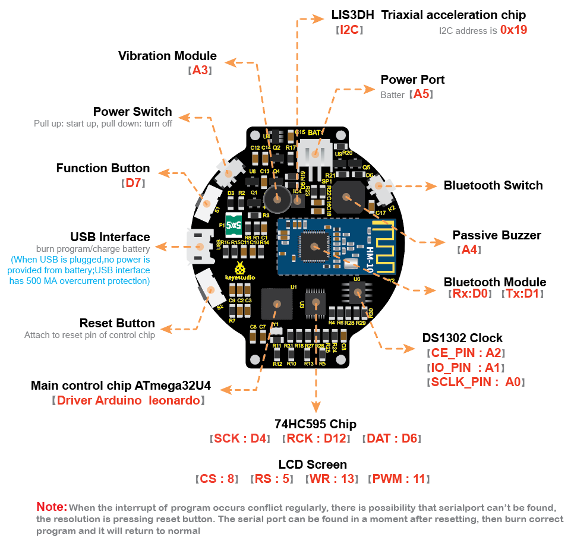
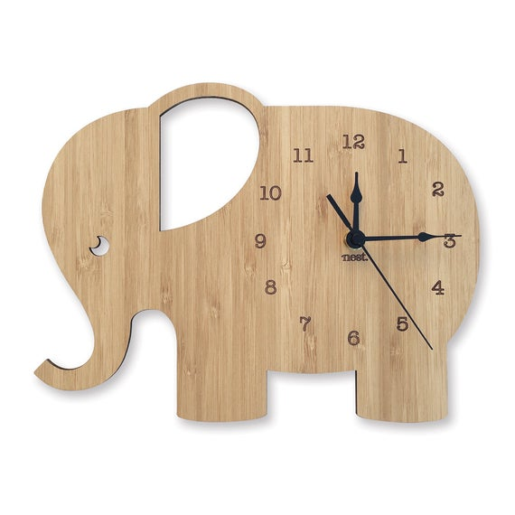
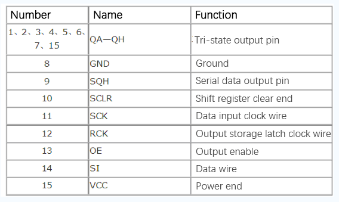
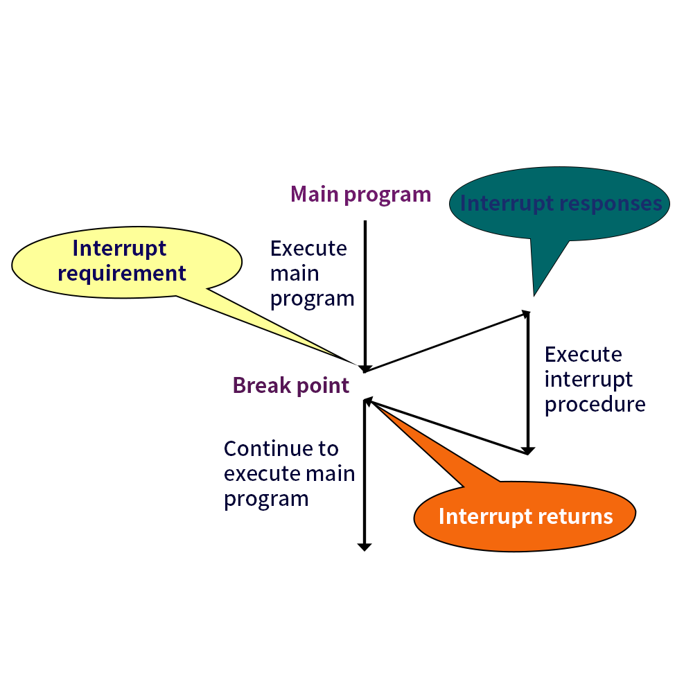

# KS0519 DIY Smart Sports Watch for Arduino


# **1.Introduction**

****

In general sense, the watch is ubiquitous in our life. So how about making a watch on your own?

The new smart sports watch rolled out by keyes team, can be taken as a step counter, an ordinary watch or an alarm clock.

That sounds cool, right?

You could figure out its structure and its working principle without worrying about the annoying operation process.

The different tutorials are also provided for you. Alongside that, combing them with basic Arduino knowledge would contribute to customize your own watch readily.

# **2.kit list**

First, check the components in this kit when you get this watch.


# **3.Installation**

**Prepare the parts as follows：**

| Board A \*1 | Board C \*1 | Lithium battery \*1  |
|-----------------------------------------------------|--------------------------------|--------------------------------------------------------------------------|
|**Board B \*1**|**Board D \*1**|**Development board \*1**|
|**Screwdriver\*1**|**Nut\*4**|**M2\*14MM round head screw \*4**|
|**Watch strap**|||


# **4.Function**

1. Built-in clock chip-----display time on screen through APP.

2.  Inclusive of buzzer and motor----when setting the alarm clock on App, the watch will buzz and make sounds.
    
3.  The screen shows the number of steps

4.  Shortly press the function button to switch dial plate.

5.  Hold down the function button to make screen locked, and hold down again, the screen will be bright.
    
6.  The screen shows the battery capacity

7. Adjust the screen brightness by APP

8. The lithium battery which is rechargeable is included

Note: remember to turn on Power Switch when charging

# **5.Application**


1.  The watch boots and displays time and steps when pulling up the power switch. The steps will increase when you wear it.
    
2.  When the function button is pressed shortly, the set alarm clock and battery voltage will be shown. And press it again to return the initial interface; if you hold it down, the screen will be locked.
    
3.  Turn on the Bluetooth switch, then the blue LED will flash. Flashing means no Bluetooth connection; always on implies Bluetooth connected.  
4. Press the reset button to reboot the watch.

5.  USB Interface is for charging and downloading program  
6. The watch screen can show the English letters, numbers and symbols in
    different color and size.

7.  display time: hour/minute/second  
8. display “week”  
9. display steps  
10. TX is an indicator to send data. It blinks when burning the program.  
11.  Bluetooth indicator-----Flashing means no Bluetooth connection; the indicator always on implies Bluetooth connected.  
12.  RX is an indicator to receive data. It flashes when burning the program.  
13. Show the date: year/month/day

# **6.Install APP**

**IOS System**

Go to App store to search keyes DIY watch and download.


**Android system**

Enter Google play to search keyes DIY watch and download it.






# **7.Install Arduino IDE and Driver**

**（1）Installing Arduino IDE**

When we get control board, we need to download Arduino IDE and driver firstly.

You could download Arduino IDE from the official website: <https://www.arduino.cc/>, click the **SOFTWARE** on the browse bar, click“DOWNLOADS” to enter download page, as shown below:


There are various versions Of IDE for Arduino, just download a version that compatible with your system, here we will show you how to download and install the windows version Arduino IDE.


There are two versions of IDE for WINDOWS system, you can choose between the Installer (.exe) and the Zip packages. We suggest you use the first one that installs directly everything you need to use the Arduino Software (IDE), including the drivers. With the Zip package you need to install the drivers manually. The Zip file is also useful if you want to create a portable installation.



You just need to click JUST DOWNLOAD.

**（2）ATmega32u4 Control Chip**

Firmware：Arduino Leonardo

Supply voltage：3.3V

ATmega32u4 peripheral circuit:



Arduino Leonardo (ATmega32u4）pins：



ATmega32u4 has 20 digital input/output pins (of which 7 can be used as PWM outputs), 12 analog inputs, a 16 MHz crystal oscillator.

It boasts 32KB flash(of which 4KB is used by program), 2.5KB SRAM and 1KB EEPROM.

It contains everything needed to support the microcontroller; simply connect it to a computer with a USB cable or power it with a AC-to-DC adapter or battery to get started. Note that ICSP (In-Circuit Serial Programming) header can not only program the firmware to Atmega32u4, but also be used as SPI communication interface.   

The keyestudio Leonardo can be powered via the micro USB connection, or via an external power supply jack (DC 7-12V) or even with female headers Vin /GND (DC 7-12V).  

The Leonardo differs from other Arduino boards using separate USB-Serial chip in that the ATmega32u4 has built-in USB communication, eliminating the need for a secondary processor. This allows the Leonardo to appear to a connected computer as a mouse and keyboard.

pinMode(), digitalWrite(), and digitalRead() respectively stand for pin mode, input the digital pin and read the digital pin.

Every I/O pin can be used as input or output, boasting a 20-50K Ω pull-up resistor. It can output or input the maximum 40ma current.

The special function of other pins are listed as below: 
UART: 0（RX）and 1（TX）use ATmega32U4 serial to receive and send the TTL serial data. Attention that Leonardo's Serial class refers to USB (CDC) communication, and the TTL serial ports of pins 0 and 1 use the Serial1 class. (communicate with Bluetooth in the watch).

TWI：2（SDA）and 3（SCL）support communication by Wire, however, it is used to communicate with LIS3DH acceleration chip.

External Interrupt；0.1.2.3.7 expand Interrupt pins through library file：8.9.10.11.SCK,MOSI,MISO,SS


Library file address：https://github.com/GreyGnome/EnableInterrupt
（the buttons of watch use the pin D7 and Interrupt4）

Example Interrupt program：attachInterrupt(4, use, FALLING);

PWM:Pin 3, 5, 6, 9, 10, 11 and 13 support 8-bit PWM output by analogWrite()

Pin 11 of watch is used to control the screen brightness by PWM output

SPI: ICSP pin, support SPI communication by SPI library.

Analog input：A0〜A5，A6\~A11（digital pin 4，6，8，9，10，12） ，32U4 has 12 analog input，from A0 to A11，they can be as I / O ports. A6-A11are respectively pin 4，6，8，9，10 and12. Each analog input has 10 bit resolution(namely 1024 different values). On the default condition，analog input is 0-5V，the voltage can be changed by AREF pins.

Other pins：

AREF: read the analog signal by function analogReference().

Reset: initialize Arduino

Program via Arduino software, select Tool\>board\>Arduino Leonardo

**（3）Installing Driver**

Next to install the driver for smart sports watch. Connect smart watch and computer by USB cable, then the computer will recognize the hardware.

Right click Computer----- Properties----- Device Manager.


Enter the device manager, Arduino Leonardo is displayed and there is a yellow exclamation mark on the page.

Double click Arduino Leonardo to install driver.


Click“Update Driver”


There is a DRIVERS folder in Arduino software installed package. Select this folder and click “Next”.


Then the dialog box is shown as below:


Click “Install”.


Check again in device manager, the driver of Leonardo is installed successfully as follows:


**（4）Arduino IDE Setting**

Clickicon，open Arduino IDE.



When downloading the sketch to the board, you must select the correct name of Arduino board that matches the board connected to your computer. As shown below;


Then select the correct COM port (you can see the corresponding COM port after the driver is successfully installed)


Before uploading the program to the board, let’s demonstrate the function of each symbol in the Arduino IDE toolbar.


A- Used to verify whether there is any compiling mistakes or not.  

B- Used to upload the sketch to your Arduino board.  

C- Used to create shortcut window of a new sketch.  

D- Used to directly open an example sketch.  

E- Used to save the sketch.  

F- Used to send the serial data received from board to the serial monitor.

**（5）Start First Program**

Open the file to select **Example**, and click **BASIC**\>**BLINK**, as shown below:


Set the correct **COM port,** and the corresponding board and COM port are shown on the lower right of IDE.


Clickto start compiling the program, and check errors.


Clickto upload the program


Upload the program successfully. And our first program is finished.


# **8.Projects**

**Pins Description**



**How to add a library file**

**Step 1：** After downloading well the Arduino IDE, you can right-click the icon of Arduino IDE.  

Find the option "Open file location" shown as below:

[](http://wiki.keyestudio.com/index.php/File:Libraries_1.png)

**Step 2:** Enter it to find out libraries folder, this folder is the library file of Arduino.


**Step 3：** Next to find out the“libraries”folder of sports watch(seen in the link: https://fs.keyestudio.com/KS0519), you just need to replicate and paste all of libraries files
 into the libraries of Arduino IDE.


Then the libraries of sports watch are installed successfully.

## **Project 1: Vibration Motor**

**(1) Description**

In previous lesson, we install the driver of smart sports watch and burn the test code. Next, we will get started with our basic lesson--- driving the vibration motor of sports watch.


The vibration motor adopts the 2N7002 MOS transistor amplifier driver which can be directly
controlled by the digital port. In this way, the electrical signals can be converted in mechanic vibration, which is applied to production of wearable device, buzz notification and vibration interactive products.

In this lesson, we compile a test code to drive the vibration motor. The different vibration effects could be performed by changing the delay time in the code. Plug in GND and VCC. As the S end is high level, motor will vibrate; when it is low level, motor won’t work.

**（2）Specification**

-   Rated voltage: 5.0VDC

-   Working voltage: 3.0-5.3VDC

-   Rated speed: minimum 9000 rpm

-   Rated current: 60 mA max

-   Starting current: 90 mA max

-   Starting voltage: DC3.7V

**（3）Circuit Diagram**


**（4）Test Code：**

Through circuit diagram, the signal pin of vibration motor is connected to A3 pin(equal to D17)


```
/*
 keyestudio smart sports watch
 lesson 1
 Vibration motor
 http://www.keyestudio.com
*/
void setup()
 { 
    pinMode(A3, OUTPUT);// initialize digital pin A3 as an output.
}
void loop() // the loop function runs over and over again forever
{
   digitalWrite(A3, HIGH); // turn the  Vibration motor on 
   delay(1000); // wait for a second
   digitalWrite(A3, LOW); // turn the  Vibration motor off 
   delay(1000); // wait for a second
}
```

**（5）Test Result：**


After the test code is uploaded, the vibration motor will vibrates one second and stop for one second

**（6）Code Explanation:**

**pinMode(A3，OUTPUT) -** This function can denote that the pin is INPUT or OUTPUT

**digitalWrite(A3，HIGH) -** When pin is OUTPUT, we can set it to HIGH(output 3.3V) or LOW(output 0V)

## **Project 2: Passive Buzzer**

**（1）Description**


We can use Arduino to make many interactive works of which the most commonly used is acoustic-optic display.   

The buzzer we introduced is a passive buzzer. It cannot be actuated by itself, but by external pulse frequencies.   

Different frequencies produce different sounds. You can use Arduino to code the melody of a song, which is quite fun and simple.

It is widely applied to a great deal of equipment, electrical production and micro controller, etc; because it is small, light, cost-effective and durable.

**（2）Specification:**

-   Rated voltage (Vo-p): 1.5V, 3V, 12V

-   Working voltage (Vo-p): 1-2V, 3-8V, 6-15V

-   Coil resistance (Ω): 16±4, 47±5, 140±14

-   Rated current (MAX): 30mA, 40mA, 40mA

-   Minimum sound pressure: 80dB@10cm, 85dB@10cm, 85dB@10cm

-   Frequency: 2400Hz

-   Working temperature: -30-+70

-   Storage temperature: -40-+85

**（3）Circuit Diagram**


**（4）Test Code**

In this lesson, we drive buzzer to emit “tick,tick” by test code.

The signal pin is linked with A4(equal to D18)

```
/*
keyestudio smart sports watch
Project 2.1
Buzzer
http://www.keyestudio.com
*/
int tonepin = A4; // Set the Pin of the buzzer to the digital A4
     void setup ()
     {
       pinMode (tonepin, OUTPUT); // Set the digital IO pin mode to output
     }
     void loop ()
     {
       unsigned char i, j;
       while (1)
       {
         for (i = 0; i <80; i ++) // output a frequency sound
         {
           digitalWrite (tonepin, HIGH); // Sound
           delay (1); // Delay 1ms
           digitalWrite (tonepin, LOW); // No sound
   delay (1); // Delay 1ms
    }
   for (i = 0; i <100; i ++) // output sound with another frequency
    {
   digitalWrite (tonepin,HIGH);// Sound
   delay (2); //delay 2ms
   digitalWrite (tonepin,LOW);// No sound
   delay (2);// delay 2ms
   }
   }
   }
```

**（5）Test Result：**


The passive buzzer will emit “tick,tick” with different tones after compiling code.

**Code analysis**

When we need to repeat some statements, we have to use“for”statement.

The format of for statement is shown below:


for (i = 0; i \<80; i ++) - the value of i increase from 1 to 80

**(6) Extension Practice：Compose a song**

We will play fabulous music if we control frequency and beats well, so let’s figure out the frequency of tones. As shown below:

Bass：

| Tone Note | 1\# | 2\# | 3\# | 4\# | 5\# | 6\# | 7\# |
|-----------|-----|-----|-----|-----|-----|-----|-----|
| A         | 221 | 248 | 278 | 294 | 330 | 371 | 416 |
| B         | 248 | 278 | 294 | 330 | 371 | 416 | 467 |
| C         | 131 | 147 | 165 | 175 | 196 | 221 | 248 |
| D         | 147 | 165 | 175 | 196 | 221 | 248 | 278 |
| E         | 165 | 175 | 196 | 221 | 248 | 278 | 312 |
| F         | 175 | 196 | 221 | 234 | 262 | 294 | 330 |
| G         | 196 | 221 | 234 | 262 | 294 | 330 | 371 |

Alto：

| Tone Note | 1   | 2   | 3   | 4   | 5   | 6   | 7   |
|-----------|-----|-----|-----|-----|-----|-----|-----|
| A         | 441 | 495 | 556 | 589 | 661 | 742 | 833 |
| B         | 495 | 556 | 624 | 661 | 742 | 833 | 935 |
| C         | 262 | 294 | 330 | 350 | 393 | 441 | 495 |
| D         | 294 | 330 | 350 | 393 | 441 | 495 | 556 |
| E         | 330 | 350 | 393 | 441 | 495 | 556 | 624 |
| F         | 350 | 393 | 441 | 495 | 556 | 624 | 661 |
| G         | 393 | 441 | 495 | 556 | 624 | 661 | 742 |

Treble：

| Tone Note | 1\# | 2\#  | 3\#  | 4\#  | 5\#  | 6\#  | 7\#  |
|-----------|-----|------|------|------|------|------|------|
| A         | 882 | 990  | 1112 | 1178 | 1322 | 1484 | 1665 |
| B         | 990 | 1112 | 1178 | 1322 | 1484 | 1665 | 1869 |
| C         | 525 | 589  | 661  | 700  | 786  | 882  | 990  |
| D         | 589 | 661  | 700  | 786  | 882  | 990  | 1112 |
| E         | 661 | 700  | 786  | 882  | 990  | 1112 | 1248 |
| F         | 700 | 786  | 882  | 935  | 1049 | 1178 | 1322 |
| G         | 786 | 882  | 990  | 1049 | 1178 | 1322 | 1484 |

Next, we need to control the playing time the note. The music will be produced when every note plays a certain amount of time. Besides, a note rhythm is divided into one beat, half beat, 1/4 beat, 1/8 beat and we stipulate the time for a note to be 1, half beat is 0.5, 1/4 beat is 0.25, 1/8 beat is 0.125.....; accordingly, the music is played.

We will take example of “Ode to joy”


From the above notation, the music is 4/4 beat.

There are special notes we need to explain:

1.  Normal note, like the first note 3, which corresponds to 350(frequency), occupy 1 beat
    
2.  The note with underline means 0.5 beat

3.  The note with dot()means that 0.5 beat is added, that is, 1+0.5 beat
    
4.  The note with”—” represents that 1 beat is added, that is, 1+1 beat.

5.  The two successive notes with arc imply legato. You could alter the frequency of the note behind legato(need to debug it yourself), such like reducing or increasing some values, then the sound will be more smoother.

**Test Code**

```
/*
keyestudio smart sports watch
Project 2.2
Buzzer music
http://www.keyestudio.com
*/
#define NTD0 -1
#define NTD1 294
#define NTD2 330
#define NTD3 350
#define NTD4 393
#define NTD5 441
#define NTD6 495
#define NTD7 556
#define NTDL1 147
#define NTDL2 165
#define NTDL3 175
#define NTDL4 196
#define NTDL5 221
#define NTDL6 248
#define NTDL7 278
#define NTDH1 589
#define NTDH2 661
#define NTDH3 700
#define NTDH4 786
#define NTDH5 882
#define NTDH6 990
#define NTDH7 112
// List all D-tuned frequencies
#define WHOLE 1
#define HALF 0.5
#define QUARTER 0.25
#define EIGHTH 0.25
#define SIXTEENTH 0.625
// List all beats
int tune [] = // List each frequency according to the notation
{
  NTD3, NTD3, NTD4, NTD5,
  NTD5, NTD4, NTD3, NTD2,
  NTD1, NTD1, NTD2, NTD3,
  NTD3, NTD2, NTD2,
  NTD3, NTD3, NTD4, NTD5,
  NTD5, NTD4, NTD3, NTD2,
  NTD1, NTD1, NTD2, NTD3,
  NTD2, NTD1, NTD1,
  NTD2, NTD2, NTD3, NTD1,
  NTD2, NTD3, NTD4, NTD3, NTD1,
  NTD2, NTD3, NTD4, NTD3, NTD2,
  NTD1, NTD2, NTDL5, NTD0,
  NTD3, NTD3, NTD4, NTD5,
  NTD5, NTD4, NTD3, NTD4, NTD2,
  NTD1, NTD1, NTD2, NTD3,
  NTD2, NTD1, NTD1
};
float durt [] = // List the beats according to the notation
{
  1,1,1,1,
  1,1,1,1,
  1,1,1,1,
  1 + 0.5,0.5,1 + 1,
  1,1,1,1,
  1,1,1,1,
  1,1,1,1,
  1 + 0.5,0.5,1 + 1,
  1,1,1,1,
  1,0.5,0.5,1,1,
  1,0.5,0.5,1,1,
  1,1,1,1,
  1,1,1,1,
  1,1,1,0.5,0.5,
  1,1,1,1,
  1 + 0.5,0.5,1 + 1,
};
int length;
int tonepin = A4; // Use interface A4
void setup ()
{
  pinMode (tonepin, OUTPUT);
  length = sizeof (tune) / sizeof (tune [0]); // Calculate length
}
void loop ()
{
  for (int x = 0; x <length; x ++)
  {
    tone (tonepin, tune [x]);
    delay (500 * durt [x]); // This is used to adjust the delay according to the beat, 500 can be adjusted by yourself.
    noTone (tonepin);
  }
  delay (2000); // delay 2s
}
```


Advanced version of Arduino IDE sometimes toughly identify the format of test code, consequently, the problem occurs as follows:


Please directly open the test code of libraries folder : <https://fs.keyestudio.com/KS0519>


Upload the code to the development board, do you hear “Ode to Joy”?

## **Project 3: Detect and Read Voltage（0-1024）**

**（1）Description**


This project is used to detect voltage, based on the principle of resistance divide voltage, aiming to measure the voltage over 5v and to decline two times of input voltage.

The analog voltage is up to 5V, consequently, the input voltage is less than or equal to 5V×2=10V(the working voltage of control chip is 3.3v( the IC working voltage is 3.3V. Thus, the batteries voltage must be less than or equal to 3.3Vx2=6.6V, or the measurement is not correct)

Arduino uses AVR chip with 10 bit AD; therefore, the resolution of this module is 0.0032V（3.3V/1023).

**(2) Circuit Diagram**

****

**(3) Test Code**

Through circuit diagram, the signal pin detected by voltage is connected to A5 pin.

```
/*
keyestudio smart sports watch
Project 3
Voltage detection
http://www.keyestudio.com
*/
const int Electric = A5;
  void setup()
   {
  Serial.begin(9600);
  pinMode(Electric,INPUT);
   }

void loop() {
  float dian=analogRead(Electric);
  float DL=(dian/1024*3.3)*2;//convert battery capacity
  Serial.print(DL);
  Serial.println("V");
  delay(1000);
}
```


**(4) Test Result**


Let’s compile code, open serial monitor and set baud rate to 9600. We can view the battery capacity.

## **Project 4: Button Switch**

**（1）Description**

I believe that button switch is ubiquitous in our lives. It belongs to switch quantity( digital value)component. Composed of normally open contact and normally closed contact, its working principle is similar to ordinary switch.

When the normally open contact bears pressure, the circuit will stay ON state; however, when this pressure disappears, the normally open contact will go back to initial state, that is, off state. The pressure is the act we switch the button.

We will do an experiment with a button switch to make you know more about input function of I/O ports of Arduino.

**（2）Specification**

-   Rated range: 500mA 12VDC

-   Contact Resistance : 50mΩ max(initial)

-   Insulation Resistance: 100MΩ（minDC 250V）

-   Dielectric Strength : AC250V(50/60Hz for 1minute)

-   Electrically Life:50,000cycles

-   Environment temperature: -25℃-70℃

-   Operating Force: 180/220/250(±30gf)

**（3）Circuit Diagram**


**（4）Test Code**


```
/*
keyestudio smart sports watch
Project 4.1
Button
http://www.keyestudio.com
*/
// digital pin 2 has a pushbutton attached to it. Give it a name:
int pushButton = 7;

// the setup routine runs once when you press reset:
void setup() {
  // initialize serial communication at 9600 bits per second:
  Serial.begin(9600);
  // make the pushbutton's pin an input:
  pinMode(pushButton, INPUT);
}

// the loop routine runs over and over again forever:
void loop() {
  // read the input pin:
  int buttonState = digitalRead(pushButton);
  // print out the state of the button:
  Serial.println(buttonState);
  delay(1);        // delay in between reads for stability
}
```


**(5) Test Result**


Upload code, open serial monitor and set baud rate to 9600. The printed value changes 1 into 0 when pressing button.

**(6) Extension Practice 1: Displays“hello world”**


```
/*
keyestudio smart sports watch
Project 4.2
Button
http://www.keyestudio.com
*/
const int btn = 7;
int btn_val = 0;
void setup() {
  Serial.begin(9600);
  pinMode(btn,INPUT);
}
void loop() {
  btn_val = digitalRead(btn);
  //Serial.println(btn_val);
  if(btn_val == 0)
  {
    delay(100);//defend shaking
    if(btn_val == 0)
    {
      Serial.println("hello world");
    }
  }
}
```


**Test Result:**


Upload code , open serial monitor and set baud rate to 9600. The serial monitor displays “hello world” when pressing button.

**(7) Extension Practice 2: Display the number of clicks**


```
/*
keyestudio smart sports watch
Project 4.3
Button
http://www.keyestudio.com
*/
const int btn = 7;
int btn_val = 0;
int flag;
int count;
void setup() {
  Serial.begin(9600);
  pinMode(btn,INPUT);
}
void loop() {
  btn_val = digitalRead(btn);
  //Serial.println(btn_val);
  if(btn_val == 0)
  {
    delay(10);
    if(btn_val == 0)
    {
      while(1)
      {
        btn_val = digitalRead(btn);
        if(btn_val == 1)
        {
          count++;
          Serial.println(count);
          break;
        }
      }
    }
  }
}
```


**Test Result:**


Upload code, open serial monitor and set baud rate to 9600. The displayed number increases by 1 when pressing button every time.

## **Project 5: Clock DS1302 Program**

****

**（1）Description**

DS1302, a trickle charge clock chip rolled out by DALLAS, is inclusive of a real-time clock(calendar) and 31 bytes of static RAM.

The DS1302 can communicate with the single-chip microcomputer through the synchronous serial way and only three ports needed which are RST reset , I/O data line and SCLK serial clock.

The real-time clock/calendar circuit provides information about seconds, minutes, hours, days, weeks, months, and years. In addition, the number of days in a month and ones of a leap year can be adjusted automatically.

Compatible with DS1202, it has a 31×8 RAM register for temporary storage of data.

The clock operation can adopt 24 or 12 hour format through AM/PM indication.

**（2）Specification**

-   Strong performance: DS1302 is a real-time clock chip, which can provide information such as seconds, minutes, hours, date, month, and year, and can read the calendar before 2100 .
    
-   Data storage: 31 bytes of data storage

-   Serial I/O communication: save the use of IO ports

-   Wide voltage supply: work normally in the range of 2.0～5.5 V

-   Low power consumption: When the working voltage is 2.0 V, the working current is less than 300 mA.
    
-   Working temperature: -40℃-65℃

**（3）Circuit Diagram**


The SCLK , I/O and RST pin are respectively connected to A0, A1 and A2.

**(4) Test Code**

```
/*
keyestudio smart sports watch
Project 5
DS1302
http://www.keyestudio.com
*/
#include <stdio.h>
#include <string.h>
#include <DS1302.h>
/* Set the appropriate digital I/O pin connections */
uint8_t CE_PIN   = A2;//DS1302 enable pin
uint8_t IO_PIN   = A1;//DS1302 data pin
uint8_t SCLK_PIN = A0;//DS1302 clock pin
/* Create buffers */
/* Create a DS1302 object */
DS1302 rtc(CE_PIN, IO_PIN, SCLK_PIN);
void setup()
{
  Serial.begin(9600);
  rtc.write_protect(false);
  rtc.halt(false);
  Time t(2009, 5, 19, 21, 16, 37, 3);//set year, month, day, hour, minute, second, week
  rtc.time(t);
}
/* Loop and print the time every second */
void loop()
{
Time t = rtc.time();
Serial.print(t.yr);//year
Serial.print("-");
Serial.print(t.mon);//month
Serial.print("-");
Serial.print(t.date);//day
Serial.print("  ");
Serial.print(t.hr);//hour
Serial.print(":");
Serial.print(t.min);//minute
Serial.print(":");
Serial.print(t.sec);//second
Serial.print("  ");
Serial.println(t.day);//week
delay(1000);
}
```


**(5) Test Result:**


The serial monitor prints year, month, day, hour, minute, second and week.

## **Project 6: TFT LCD Display Module**

**（1）Description**

The screen of smart sports watch is a 2.2inch TFT crystal display module which can display colorful patterns and words. Its input voltage is 3.3V\~5.5V. The refreshing-screen speed is 256ms and consequently shows multiple patterns cyclically and dynamic display.

In the library, there are defined 19 common colors. Meanwhile, you could customize colors by yourselves.

The center of the screen is taken as the origin of the coordinates and the maximum absolute value of the positive and negative semi-axes is 64.

Note: 2.2 inch is marked by screen supplier, yet, the real displayed area is around 1.26inch（32mm in diameter).

**（2）Specification**

-   Working voltage: 3.3V\~5.5V

-   Working current: 40mA

-   Display color: color

-   Resolution: 128\*128

-   Refresh rate: 10Hz (MAX)

-   Interface: 8 bits

-   Viewing angle: 12:00

-   Drive: ST7687S

-   Communication interface: SPI

-   Working temperature: -30℃\~+70℃

-   Module size: 46x49 mm

-   Size: 2.2INCH

**（3）Circuit Diagram**



To save the IO port, we use a 74HC595 chip to drive the 8 bit data input pin of screen.

| 74HC595 |  →   | 32U4 chip |
| :-----: | :--: | :-------: |
|  SCLK   |  →   |    D4     |
|   D4    |  →   |    D12    |
|   SI    |  →   |    D6     |


| TFT LCD display module |  →   | 32U4 chip |
| :--------------------: | :--: | :-------: |
|           WR           |  →   |    D13    |
|           RS           |  →   |    D5     |
|           CS           |  →   |    D8     |


**（4）Test Code**


```
/*
keyestudio smart sports watch
Project 6.1
Screen
http://www.keyestudio.com
*/
#include "KS_ST7687S_Latch.h"
int screen=1;
uint8_t pin_cs = 8, pin_rs = 5, pin_wr = 13, pin_lck = 12, pin_spi_scl = 4, pin_spi_mosi = 6;
KS_ST7687S_Latch tft(pin_cs, pin_rs, pin_wr , pin_lck, pin_spi_scl, pin_spi_mosi);
void setup(void)
{
  Serial.begin(115200);
  pinMode(11,OUTPUT);   //Pin 11 controls the brightness of screen
  analogWrite(11,254);  //value is in the range of 0~255
   tft.begin();   //Initialize the screen setting
}
void loop(void)
{
  tft.fillScreen(1000);  // refresh the color of screen, value is [0,65535] or 4-digit hexadecimal code
  delay(1000);
  tft.fillScreen(0x0030); 
  delay(1000);
  tft.fillScreen(DISPLAY_RED);  //define the 19 common colors in the function library
  delay(1000);
  tft.fillScreen(DISPLAY_GREEN);  
  delay(1000);
  tft.fillScreen(DISPLAY_BLUE);  
  delay(1000);
  tft.fillScreen(DISPLAY_WHITE);
  delay(1000);
  tft.fillScreen(DISPLAY_BLACK);  
  delay(1000);
}
```


**（5）Test Result**

****

After uploading test code, we will see the watch screen refresh and show red, green, blue, white and black color, etc.

**（6）Extension Practice 1：Multiple Patterns**


```
/*
keyestudio smart sports watch
Project 6.2
Screen
http://www.keyestudio.com
*/

#include "KS_ST7687S_Latch.h"
int screen=1;
uint8_t pin_cs = 8, pin_rs = 5, pin_wr = 13, pin_lck = 12, pin_spi_scl = 4, pin_spi_mosi = 6;
KS_ST7687S_Latch tft(pin_cs, pin_rs, pin_wr , pin_lck, pin_spi_scl, pin_spi_mosi);
  
void setup(void)
{
  Serial.begin(115200);
  pinMode(11,OUTPUT);   //Pin 11 controls the brightness of screen
  analogWrite(11,254);  //value is in the range of 0~255
  
  tft.begin();   //initialize the screen’s setting
  tft.fillScreen(DISPLAY_WHITE); //background is white
}


void loop(void)
{
  tft.drawCircle(0, 0, 20, DISPLAY_GREEN);  //draw circle
  delay(1000);
  tft.fillCircle(0, 0, 20, DISPLAY_RED);  //fill circle
  delay(1000);
  tft.fillScreen(DISPLAY_WHITE);
  tft.drawRect(-20, -20, 40, 40, DISPLAY_BLUE);  //draw rectangle
  delay(1000);
  tft.fillRect(-20, -20, 40, 40, DISPLAY_BLUE);  //fill rectangle
  delay(1000);
  tft.fillScreen(DISPLAY_WHITE);
  tft.drawTriangle(-20, -50, 0, 0, 50, 20, DISPLAY_ORANGE);  //draw triangle
  delay(1000);
  tft.fillTriangle(-20, -50, 0, 0, 50, 20, DISPLAY_ORANGE);  //fill triangle with color
  delay(1000);
  tft.fillScreen(DISPLAY_BLACK);
  tft.drawLine(-64, -64, 64, 64, DISPLAY_RED);  //draw line
  tft.drawHLine(-64, 0, 128, DISPLAY_WHITE);  //draw horizontal line
  tft.drawVLine(0, -64, 128, DISPLAY_WHITE);  //draw vertical line
  delay(1000); 
  tft.fillScreen(DISPLAY_WHITE);
}
```


**Test Result：**


Upload the test and observe the screen. It will orderly appear a green circular, a red circular, a blue square and an orange triangle. Next, the screen is all black, and three slashes appear.

**（7）Extension Practice 2：Display character string**


```
/*
keyestudio smart sports watch
Project 6.3
Screen
http://www.keyestudio.com
*/

#include "KS_ST7687S_Latch.h"
int screen=1;

uint8_t pin_cs = 8, pin_rs = 5, pin_wr = 13, pin_lck = 12, pin_spi_scl = 4, pin_spi_mosi = 6;
KS_ST7687S_Latch tft(pin_cs, pin_rs, pin_wr , pin_lck, pin_spi_scl, pin_spi_mosi);
  
void setup(void)
{
  Serial.begin(115200);
  pinMode(11,OUTPUT);   //Pin 11 controls the brightness of screen
  analogWrite(11,254);  // value is in the range of 0~255
  
  tft.begin();   //Initialize the screen setting
  tft.fillScreen(DISPLAY_BLACK); //background is black
}

 
void loop(void)
{
  tft.setCursor(30, 55);  //set the initial coordinates of character printing
  tft.setTextBackground(DISPLAY_YELLOW);  //set text background to black
  tft.setTextColor(DISPLAY_BLUE);  //set text color to white
  tft.setTextSize(2);  //2 * text size, default text size: 12 * 16
  tft.print("Hello");
  tft.setCursor(30, 71);
  tft.setTextBackground(DISPLAY_GREEN);
  tft.setTextColor(DISPLAY_RED);
  tft.setTextSize(1);
  tft.print("World!");
  delay(1000);
}
```


Upload the test code, and “Hello world” is shown on the screen

**（8）Extension Practice 3：Show time**


```
/*
keyestudio smart sports watch
Project 6.4
Screen
http://www.keyestudio.com
*/
#include <DS1302.h>
#include "KS_ST7687S_Latch.h"
uint8_t CE_PIN   = A2;//DS1302enable pin
uint8_t IO_PIN   = A1;//DS1302data pin
uint8_t SCLK_PIN = A0;//DS1302 clock pin
uint8_t pin_cs = 8, pin_rs = 5, pin_wr = 13, pin_lck = 12, pin_spi_scl = 4, pin_spi_mosi = 6;
KS_ST7687S_Latch tft(pin_cs, pin_rs, pin_wr , pin_lck, pin_spi_scl, pin_spi_mosi);

DS1302 rtc(CE_PIN, IO_PIN, SCLK_PIN);
  
void setup(void)
{
  Serial.begin(9600);
  rtc.write_protect(false);
  rtc.halt(false);
  Time t(2009, 5, 19, 21, 16, 37, 3);//Set time, month, day, time, hour, minute,second,week
  rtc.time(t);

  pinMode(11,OUTPUT);   //Pin 11 controls the brightness of screen  
  analogWrite(11,254);  //value is in the range of 0~255
  
  tft.begin();   //Initialize the screen setting
  tft.fillScreen(DISPLAY_BLUE); //background is blue
  tft.fillCircle(0, 0, 58, DISPLAY_WHITE);
}


void loop(void)
{
  Time t = rtc.time();//Update time
  
  tft.setCursor(15, 55);  //set the initial coordinates of character printing
  tft.setTextBackground(DISPLAY_BLUE);  //set text background to black
  tft.setTextColor(DISPLAY_RED);  //set text color to red
  tft.setTextSize(2);  //2 * text size, default text size: 12 * 16
  tft.print(t.hr/10);
  tft.print(t.hr%10);
  tft.print(":");
  tft.print(t.min/10);
  tft.print(t.min%10);
  tft.print(":");
  tft.print(t.sec/10);
  tft.print(t.sec%10);
    delay(1000);
}
```


**Test Result：**


After uploading code, the screen will display time.

**（9）Extension Practice4：Refresh clock（h/m/s）**


```
/*
keyestudio smart sports watch
Project 6.5
Screen
http://www.keyestudio.com
*/

#include <DS1302.h>
uint8_t CE_PIN   = A2;//DS1302 enable pin
uint8_t IO_PIN   = A1;//DS1302 data pin
uint8_t SCLK_PIN = A0;//DS1302 clock pin
DS1302 rtc(CE_PIN, IO_PIN, SCLK_PIN);
#include "KS_ST7687S_Latch.h"
uint8_t pin_cs = 8, pin_rs = 5, pin_wr = 13, pin_lck = 12, pin_spi_scl = 4, pin_spi_mosi = 6;
KS_ST7687S_Latch tft(pin_cs, pin_rs, pin_wr , pin_lck, pin_spi_scl, pin_spi_mosi);
 void setup(void)
{
  Serial.begin(9600);
  
  rtc.write_protect(false);
  rtc.halt(false);
  Time t(2009, 5, 19, 21, 16, 37, 3);//Set time, month, day, time, hour, minute,second,week
  rtc.time(t);
    pinMode(11,OUTPUT);   //Pin 11 controls the brightness of screen
  analogWrite(11,254);  //value is in the range of 0~255
    tft.begin();   //Initialize the screen setting
  tft.fillScreen(DISPLAY_BLUE); //background is blue
  tft.fillCircle(0, 0, 58, DISPLAY_WHITE);
    
       tft.setCursor(8, 60);
       tft.setTextBackground(DISPLAY_WHITE);
       tft.setTextColor(DISPLAY_BLUE);  //set text color to white
       tft.setTextSize(2);  //2 * text size, default text size: 6 * 8
       tft.print(t.hr/10);
       tft.print(t.hr%10);
       tft.print(":"); 
       tft.setCursor(50, 60);
       tft.setTextBackground(DISPLAY_WHITE);
       tft.setTextColor(DISPLAY_BLUE);  //set text color to white
       tft.setTextSize(2);  //2 * text size, default text size: 6 * 8
       tft.print(t.min/10);
       tft.print(t.min%10);
       tft.print(":");
       tft.setCursor(90, 60);
       tft.setTextBackground(DISPLAY_WHITE);
       tft.setTextColor(DISPLAY_BLUE);  //set text color to white
       tft.setTextSize(2);  //2 * text size, default text size: 6 * 8
       tft.print(t.sec/10);
       tft.print(t.sec%10);
}


void loop(void)
{      int dela1,dela2,dela3,dela;//delay in interval
       dela1=millis();//obtain the time when program runs
       Time t = rtc.time(); 
       if((t.min==59)&&(t.sec==59))
        {
       tft.setCursor(90, 60);
       tft.setTextBackground(DISPLAY_WHITE);
       tft.setTextColor(DISPLAY_BLUE);  //set text color to white
       tft.setTextSize(2);  //2 * text size, default text size: 6 * 8
       tft.print(t.sec/10);
       tft.print(t.sec%10); 
       delay(1050); 
       Time t = rtc.time(); 
       tft.setCursor(8, 60);
       tft.setTextBackground(DISPLAY_WHITE);
       tft.setTextColor(DISPLAY_BLUE);  //set text color to white
       tft.setTextSize(2);  //2 * text size, default text size: 6 * 8
       tft.print(t.hr/10);
       tft.print(t.hr%10);
       tft.print(":"); 

       tft.setCursor(50, 60);
       tft.setTextBackground(DISPLAY_WHITE);
       tft.setTextColor(DISPLAY_BLUE);  //set text color to white
       tft.setTextSize(2);  //2 * text size, default text size: 6 * 8
       tft.print(t.min/10);
       tft.print(t.min%10);
       tft.print(":");
       tft.setCursor(90, 60);
       tft.setTextBackground(DISPLAY_WHITE);
       tft.setTextColor(DISPLAY_BLUE);  //set text color to white
       tft.setTextSize(2);  //2 * text size, default text size: 6 * 8
       tft.print(t.sec/10);
       tft.print(t.sec%10);  
                 }
          
        else if(t.sec==59) //refresh hour and minute
        {
       tft.setCursor(90, 60);
       tft.setTextBackground(DISPLAY_WHITE);
       tft.setTextColor(DISPLAY_BLUE);  //set text color to white
       tft.setTextSize(2);  //2 * text size, default text size: 6 * 8
       tft.print(t.sec/10);
       tft.print(t.sec%10);
       delay(1050);
       Time t = rtc.time(); //Update time
       tft.setCursor(50, 60);
       tft.setTextBackground(DISPLAY_WHITE);
       tft.setTextColor(DISPLAY_BLUE);  //set text color to white
       tft.setTextSize(2);  //2 * text size, default text size: 6 * 8
       tft.print(t.min/10);
       tft.print(t.min%10);
       tft.print(":");
       tft.setCursor(90, 60);
       tft.setTextBackground(DISPLAY_WHITE);
       tft.setTextColor(DISPLAY_BLUE);  //set text color to white
       tft.setTextSize(2);  //2 * text size, default text size: 6 * 8
       tft.print(t.sec/10);
       tft.print(t.sec%10);
          }
     else{
       Time t = rtc.time(); //Update time
       tft.setCursor(90, 60);
       tft.setTextBackground(DISPLAY_WHITE);
       tft.setTextColor(DISPLAY_BLUE);  //set text color to white
       tft.setTextSize(2);  //2 * text size, default text size: 6 * 8
       tft.print(t.sec/10);
       tft.print(t.sec%10);
         }
        dela2=millis();// obtain the time when program runs
       dela3=dela2-dela1;
       dela=1000-dela3;
       if(dela>0)
      {delay(dela);}
      else
       {
        delay(100);
        }
        }  
```


**Test Result**


After downloading the code, the watch will show time.

**（10）Extension Practice 5：Display the complete time(date and week)**


```
/*
keyestudio smart sports watch
Project 6.6
Screen
http://www.keyestudio.com
*/
#include <DS1302.h>
uint8_t CE_PIN = A2;    //DS1302enable pin
uint8_t IO_PIN = A1;    //DS1302data pin
uint8_t SCLK_PIN = A0;  //DS1302 clock pin
DS1302 rtc(CE_PIN, IO_PIN, SCLK_PIN);
#include "KS_ST7687S_Latch.h"
uint8_t pin_cs = 8, pin_rs = 5, pin_wr = 13, pin_lck = 12, pin_spi_scl = 4, pin_spi_mosi = 6;
KS_ST7687S_Latch tft(pin_cs, pin_rs, pin_wr, pin_lck, pin_spi_scl, pin_spi_mosi);
void setup(void) {
  Serial.begin(9600);
  rtc.write_protect(false);
  rtc.halt(false);
  Time t(2009, 5, 19, 21, 16, 37, 3);  //Set time, month, day, time, hour, minute,second,week
  rtc.time(t);
  pinMode(11, OUTPUT);   //Pin 11 controls the brightness of screen
  analogWrite(11, 254);  //value is in the range of 0~255

  tft.begin();                   //Initialize the screen setting
  tft.fillScreen(DISPLAY_BLUE);  //background is blue
  tft.fillCircle(0, 0, 58, DISPLAY_WHITE);
  tft.begin();
  tft.drawHLine(-58, -20, 116, DISPLAY_RED);
  //tft.drawCircle(-1, 0, 61, DISPLAY_GREEN);
  tft.setCursor(23, 20);
  tft.setTextBackground(DISPLAY_WHITE);
  tft.setTextColor(DISPLAY_YELLOW);  //set text color to white
  tft.setTextSize(2);                //2 * text size, default text size: 6 * 8
  tft.print(" WATCH ");
  tft.setCursor(8, 60);
  tft.setTextBackground(DISPLAY_WHITE);
  tft.setTextColor(DISPLAY_BLUE);  //set text color to white
  tft.setTextSize(2);              //2 * text size, default text size: 6 * 8
  tft.print(t.hr / 10);
  tft.print(t.hr % 10);
  tft.print(":");
  tft.setCursor(50, 60);
  tft.setTextBackground(DISPLAY_WHITE);
  tft.setTextColor(DISPLAY_BLUE);  //set text color to white
  tft.setTextSize(2);              //2 * text size, default text size: 6 * 8
  tft.print(t.min / 10);
  tft.print(t.min % 10);
  tft.print(":");

  tft.setCursor(90, 60);
  tft.setTextBackground(DISPLAY_WHITE);
  tft.setTextColor(DISPLAY_BLUE);  //set text color to white
  tft.setTextSize(2);              //2 * text size, default text size: 6 * 8
  tft.print(t.sec / 10);
  tft.print(t.sec % 10);
  //delay(10);
  tft.setCursor(20, 84);
  tft.setTextBackground(DISPLAY_WHITE);
  //tft.setTextBackground(DISPLAY_RED);  //set text background to black
  tft.setTextColor(DISPLAY_BLUE);  //set text color to white
  tft.setTextSize(1.5);            //2 * text size, default text size: 6 * 8
  tft.print("date:");
  tft.print(t.yr);
  tft.print("-");
  tft.print(t.mon / 10);
  tft.print(t.mon % 10);
  tft.print("-");
  tft.print(t.date / 10);
  tft.print(t.date % 10);
  tft.setCursor(40, 95);
  tft.setTextBackground(DISPLAY_WHITE);
  tft.setTextColor(DISPLAY_BLUE);  //set text color to white
  tft.setTextSize(1.5);            //2 * text size, default text size: 6 * 8
  tft.print("week: ");
  tft.print(t.day);
}
void loop(void) {
  int dela1, dela2, dela3, dela;       //delay in interval
  dela1 = millis();                    //obtain the time when program runs
  Time t = rtc.time();                 //Update time
  if ((t.min == 59) && (t.sec == 59))  //update hour
  {
    //Time t = rtc.time(); //Update time
    tft.setCursor(90, 60);
    tft.setTextBackground(DISPLAY_WHITE);
    tft.setTextColor(DISPLAY_BLUE);  //set text color to white
    tft.setTextSize(2);              //2 * text size, default text size: 6 * 8
    tft.print(t.sec / 10);
    tft.print(t.sec % 10);

    delay(1050);
    Time t = rtc.time();
    tft.setCursor(8, 60);
    tft.setTextBackground(DISPLAY_WHITE);
    tft.setTextColor(DISPLAY_BLUE);  //set text color to white
    tft.setTextSize(2);              //2 * text size, default text size: 6 * 8
    tft.print(t.hr / 10);
    tft.print(t.hr % 10);
    tft.print(":");

    tft.setCursor(50, 60);
    tft.setTextBackground(DISPLAY_WHITE);
    tft.setTextColor(DISPLAY_BLUE);  //set text color to white
    tft.setTextSize(2);              //2 * text size, default text size: 6 * 8
    tft.print(t.min / 10);
    tft.print(t.min % 10);
    tft.print(":");

    tft.setCursor(90, 60);
    tft.setTextBackground(DISPLAY_WHITE);
    tft.setTextColor(DISPLAY_BLUE);  //set text color to white
    tft.setTextSize(2);              //2 * text size, default text size: 6 * 8
    tft.print(t.sec / 10);
    tft.print(t.sec % 10);
    tft.setCursor(20, 84);
    tft.setTextBackground(DISPLAY_WHITE);
    //tft.setTextBackground(DISPLAY_RED);  //set text background to black
    tft.setTextColor(DISPLAY_BLUE);  //set text color to white
    tft.setTextSize(1.5);            //2 * text size, default text size: 6 * 8
    tft.print("date:");
    tft.print(t.yr);
    tft.print("-");
    tft.print(t.mon / 10);
    tft.print(t.mon % 10);
    tft.print("-");
    tft.print(t.date / 10);
    tft.print(t.date % 10);
    tft.setCursor(40, 95);
    tft.setTextBackground(DISPLAY_WHITE);
    tft.setTextColor(DISPLAY_BLUE);  //set text color to white
    tft.setTextSize(1.5);            //2 * text size, default text size: 6 * 8
    tft.print("week: ");
    tft.print(t.day);
  } else if (t.sec == 59)  //refresh hour and minute
  {                        //Time t = rtc.time(); //Update time
    tft.setCursor(90, 60);
    tft.setTextBackground(DISPLAY_WHITE);
    tft.setTextColor(DISPLAY_BLUE);  //set text color to white
    tft.setTextSize(2);              //2 * text size, default text size: 6 * 8
    tft.print(t.sec / 10);
    tft.print(t.sec % 10);
    delay(1050);
    Time t = rtc.time();  //Update time

    tft.setCursor(90, 60);
    tft.setTextBackground(DISPLAY_WHITE);
    tft.setTextColor(DISPLAY_BLUE);  //set text color to white
    tft.setTextSize(2);              //2 * text size, default text size: 6 * 8
    tft.print(t.sec / 10);
    tft.print(t.sec % 10);

    tft.setCursor(50, 60);
    tft.setTextBackground(DISPLAY_WHITE);
    tft.setTextColor(DISPLAY_BLUE);  //set text color to white
    tft.setTextSize(2);              //2 * text size, default text size: 6 * 8
    tft.print(t.min / 10);
    tft.print(t.min % 10);
    tft.print(":");
  } else {
    Time t = rtc.time();  //Update time
    tft.setCursor(90, 60);
    tft.setTextBackground(DISPLAY_WHITE);
    tft.setTextColor(DISPLAY_BLUE);  //set text color to white
    tft.setTextSize(2);              //2 * text size, default text size: 6 * 8
    tft.print(t.sec / 10);
    tft.print(t.sec % 10);
  }

  dela2 = millis();  // obtain the time when program runs
  dela3 = dela2 - dela1;
  dela = 1000 - dela3;
  if (dela > 0) {
    delay(dela);
  } else {
    delay(100);
  }
}
```


**Test Result**


After uploading test code, the smart watch will display the time, date and week.

## **Project 7: LIS3DH Three-axis Acceleration Module**


**(1) Description**

The LIS3DH is an ultra-low-power high-performance three-axis linear accelerometer belonging to the “nano” family, with digital I2C/SPI serial interface standard output. The device features ultra-low-power operational modes that allow advanced power saving and smart embedded functions.

The LIS3DH has dynamically user-selectable full scales of ±2g/±4g/±8g/±16g and is capable of measuring accelerations with output data rates from 1 Hz to 5.3 kHz. The self-test capability allows the user to check the functioning of the sensor in the final application. The device may be configured to generate interrupt signals using two independent inertial wake-up/free-fall events as well as by the position of the device itself. Thresholds and timing of interrupt generators are programmable by the end user on the fly. The LIS3DH has an integrated 32-level first-in, first-out (FIFO) buffer allowing the user to store data in order to limit intervention by the host processor. The LIS3DH is available in small thin plastic land grid array package (LGA) and is guaranteed to operate over an extended temperature range from -40 °C to +85 °C.

**(2) LIS3DH Parameter:**

-   Power consumption: 2μA in low power consumption mode; 11μA in normal working mode, ODR = 50Hz (pull up SDO/SA0 pins)
    
-   Measuring range: +/-2g \~ +/-16g

-   Interface: I2C, three-wire/four-wire SPI

-   16 bit data output

-   Two programmable Interrupt output pins are for free fall and motion detection.
    
-   6D/4D direction detection

-   Built-in AD supports 3-channel external signal input

-   Built-in temperature sensor

-   Built-in 32-slot 10-bit FIFO memory

-   Self-checking function

-   Package: 3 x 3 x 1 mm LGA-16

 **(3) Pin Description**


VCC: Power  

Vdd_IO: digital interface for power supply  

GND: Ground  

RES: Connect to ground  

NC: Not connected  

CS: I2C interface selects(CS=1); or SPI interface chip (CS=0)  

SCL/SPC: clock line of I2C or SPI interface

SDA/SDI/SDO: data line of I2C or SPI interface   

SDO/SA0: I2C address selection pin; or four-wire SPI interface output pin. When floating, it is 1.  

INT1: interrupt signal output. Trigger condition can be interrupted  

INT2: Same as above  

ADC1, ADC2, ADC3: analog signal input pins for digital-to-analog conversion.  

Communicate by IIC, and connect to the IIC interface of the 32U4 chip, the IIC address is 0x19

**（4）Circuit Diagram**

Communicate by I2C interface. The INT1, INT2 and FIFO function are not used.


|   VDD   |   \<------\>   |     3.3V     |
| :-----: | :------------: | :----------: |
| **GND** | **\<------\>** |   **GND**    |
| **SCL** | **\<------\>** | **D3 (SCL)** |
| **SDA** | **\<------\>** | **D2 (SDA)** |

**（5）Test Code**


```
/*
keyestudio smart sports watch
Project 7.1
LIS3DH
http://www.keyestudio.com
*/
#include <Wire.h>
#define ADDRESS_LIS3DH 0x19//communicate by IIC, connect to IIC port of 32U4 chip and IIC address is  0x19

#define CTRL_REG1 0x20
#define CTRL_REG4 0x23
#define CTRL_REG5 0x24
#define STATUS_REG 0x27
#define OUT_X_L 0x28
byte buffer[6];
byte statusReg;
boolean ready = false;
int outX, outY, outZ;
int xVal, yVal, zVal;
void setup()
{
    Wire.begin();
    Serial.begin(9600);
    delay(5); //5 ms boot procedure

    // reboot memory content, to make a clean start
    Wire.beginTransmission(ADDRESS_LIS3DH);
    Wire.write(CTRL_REG5);
    Wire.write(0x80);
    Wire.endTransmission();
    delay(5);
    //set ODR = 1 Hz, normal mode, x/y/z axis enabled
    Wire.beginTransmission(ADDRESS_LIS3DH);
    Wire.write(CTRL_REG1);
    Wire.write(0x17);
    Wire.endTransmission();
    //set BDU= 1, scale = +/-2g, high resolution enabled
    Wire.beginTransmission(ADDRESS_LIS3DH);
    Wire.write(CTRL_REG4);
    Wire.write(0x80);
    Wire.endTransmission();
}
void loop()
{
    // read STATUS_REG
    while(ready == false)
    {
        Wire.beginTransmission(ADDRESS_LIS3DH);
        Wire.write(STATUS_REG);
        Wire.endTransmission();
        Wire.requestFrom(ADDRESS_LIS3DH, 1);
        if (Wire.available() >= 1)
        {
            statusReg = Wire.read();
        }
        if (bitRead(statusReg, 3) == 1) //new data available
        {
            ready = true;
        }
        delay(10);
    }

    if (bitRead(statusReg, 7) == 1)
    {
        Serial.println("Some data have been overwritten.");
    }

    //read the result
    Wire.beginTransmission(ADDRESS_LIS3DH);
    Wire.write(OUT_X_L | 0x80); //read multiple bytes
    Wire.endTransmission();
    Wire.requestFrom(ADDRESS_LIS3DH, 6);
    if (Wire.available() >= 6)
    {
        for (int i = 0; i < 6; i++)
        {
            buffer[i] = Wire.read();
        }
    }

    //calculation
    outX = (buffer[1] << 8) | buffer[0];
    outY = (buffer[3] << 8) | buffer[2];
    outZ = (buffer[5] << 8) | buffer[4];
    xVal = outX / 16;
    yVal = outY / 16;
    zVal = outZ / 16;

    Serial.print("outX: "); Serial.print(xVal); Serial.print("  ");
    Serial.print("outY: "); Serial.print(yVal); Serial.print("  ");
    Serial.print("outZ: "); Serial.println(zVal);
    ready = false;
}
```


**（6）Test Result**

Set the update frequency of ODR to 1HZ, then serial monitor will print measured result (unit is mg).


**（7）Extension Practice 1: Calculate steps**


```
 /*
keyestudio smart sports watch
Project 7.2
LIS3DH
http://www.keyestudio.com
*/
  #include "MHEtLiveLIS3DH.h"
  #include "Wire.h"

  LIS3DH SensorOne( I2C_MODE, 0x19 );

  float a_x, a_y, a_z;
  float threshold=1.15, xyz;
  bool flag_step = 1;
  int step_count;

  void setup() {
  // put your setup code here, to run once:
  Serial.begin(9600);
  delay(1000); //relax...
  Serial.println("Processor came out of reset.\n");
  if( SensorOne.begin() != 0 )
{
  Serial.println("Problem starting the sensor at 0x19.");
}
  else
{
  Serial.println("Sensor at 0x19 started.");
}
}
  void loop()
{
  a_x = SensorOne.readFloatAccelX();
  a_y = SensorOne.readFloatAccelY();
  a_z = SensorOne.readFloatAccelZ();
  xyz = sqrt((a_x * a_x) + (a_y * a_y) + (a_z * a_z));
  if((xyz > threshold) && (flag_step == 1))
{
  step_count += 1;
  Serial.println(step_count);
  flag_step = 0;
}
  if(xyz < threshold)
{
  flag_step = 1;
}
  Serial.print("step = ");
  Serial.println(step_count);
  delay(400);
}
```


**Test Result**


Upload the test code and open serial monitor. The steps increase on serial monitor.

**（8）Extension Practice 2：Display steps**


```
 /*
keyestudio smart sports watch
Project 7.3
LIS3DH
http://www.keyestudio.com
*/
#include "KS_ST7687S_Latch.h"
#include "KSRobot_Display_Clock.h"
#include "MHEtLiveLIS3DH.h"
LIS3DH SensorOne( I2C_MODE, 0x19 );//set the address of iic to 0x19 

uint8_t pin_cs = 8, pin_rs = 5, pin_wr = 13, pin_lck = 12, pin_spi_scl = 4, pin_spi_mosi = 6;
KS_ST7687S_Latch tft(pin_cs, pin_rs, pin_wr , pin_lck, pin_spi_scl, pin_spi_mosi);
KSRobot_Display_Clock clk(&tft);

  float a_x, a_y, a_z;//the variable of three-axis acceleration
  boolean flag_step,refresh=0;;//flag bit
  float threshold=1.15,xyz;//threshold is a contrast value, which can adjust the sensitivity of the step counter
  int step_count;// step variable

  void setup()
{
  // put your setup code here, to run once:
  SensorOne.begin();
  digitalWrite(11,1);
  tft.begin();
  tft.fillScreen(DISPLAY_BLUE); //background is blue
  tft.fillCircle(0, 0, 58, DISPLAY_WHITE);
  tft.setCursor(15, 60);
  tft.setTextBackground(DISPLAY_WHITE);
  tft.setTextColor(DISPLAY_RED);  //set text color to white
  tft.setTextSize(2); 
  tft.print("step:"); 
}

  void loop() 
{
  // put your main code here, to run repeatedly:
  a_x = SensorOne.readFloatAccelX();
  a_y = SensorOne.readFloatAccelY();
  a_z = SensorOne.readFloatAccelZ();
  xyz = sqrt((a_x * a_x) + (a_y * a_y) + (a_z * a_z));
         
  if((xyz > threshold) && (flag_step == 1))
{
  step_count += 1;
  //Serial.println(step_count);   //steps
  flag_step = 0;
}
  else
{
  flag_step = 1;
} 
  tft.setCursor(74, 60);
  tft.setTextBackground(DISPLAY_WHITE);
  tft.setTextColor(DISPLAY_BLUE);  //set text color to white
  tft.setTextSize(2); 
  //tft.print("step:");
  tft.print(step_count);
}
```


**Tet Result：**


Upload the code and shake the watch, then the steps will increase.

## **Project 8: Bluetooth 4.0 Module**

**（1）Description**

Bluetooth, a simple wireless communication module most popular since the last few decades and easy to use are being used in most of the battery-powered devices.

Over the years, there have been many upgrades of Bluetooth standard to keep fulfil the demand of customers and technology according to the need of time and situation.

Over the few years, there are many things changed including data transmission rate, power consumption with wearable and IoT Devices and Security System.

Here we are going to learn about HM-10 BLE 4.0 with Arduino Board. The HM-10 is a readily available Bluetooth 4.0 module. This module is used for establishing wireless data communication. The module is designed by using the Texas Instruments CC2540 or CC2541 Bluetooth low energy (BLE) System on Chip (SoC).

**(2) Specification**

-   Bluetooth protocol: Bluetooth Specification V4.0 BLE

-   No byte limit in serial port Transceiving

-   In open environment, realize 100m ultra-distance communication with
    iphone4s.

-   Working frequency: 2.4GHz ISM band

-   Modulation method: GFSK(Gaussian Frequency Shift Keying)

-   Transmission power: -23dbm, -6dbm, 0dbm, 6dbm, can be modified by AT
    command.

-   Sensitivity: ≤-84dBm at 0.1% BER

-   Transmission rate: Asynchronous: 6K bytes ; Synchronous: 6k Bytes

-   Security feature: Authentication and encryption

-   Supporting service: Central & Peripheral UUID FFE0, FFE1

-   Power consumption: Auto sleep mode, stand by current 400uA\~800uA, 8.5mA
    during transmission.

-   Power supply: 5V DC

-   Working temperature: –5 to +65 Centigrade

**(3) Circuit Diagram:**

Connect TXD and RXD of Bluetooth module to 0 and 1 port, and program by serial 1


**(4) Test Code：**

Serial monitor shows the received data.


```
/*
keyestudio smart sports watch
lesson 8.1
bluetooth 
http://www.keyestudio.com
*/
int ble_val; //variable, used to save the value received by Bluetooth variable, used to save the value received by Bluetooth
void setup() {
  Serial1.begin(9600);
}
void loop() {
  if(Serial1.available() > 0)  //make sure if there is data in buffer
  {
    ble_val = Serial1.read();  //read the data of serial buffer
    Serial.println(ble_val);  //print
  }
}
```


Don’t insert Bluetooth module before uploading test code.

Upload the code on the development board, insert Bluetooth module and wait for the command from cellphone.

**（9）Code Explanation:**

**Serial.available()**：The characters left when going back to buffer. This function is used to determine if there is data in buffer.

When Serial.available()\>0, which means that serial receives the data.

**Serial.read():** take and read a Byte from buffer of serial port. For instance, some device sends data to Arduino through serial port. Consequently, we could read the data received by serial.read() function

**（10）Extension Practice: Adjust displayed time**

**Bluetooth communication agreement:**

-   Send 11 data every time

-   Set time：0XFF, the length of data is 11; id:1, year, month, day,hour, minute, second, and week; 0XFE
    
-   0XFE sets alarm clock: 0XFF, the length of data is 11, id:2, hour, minute, second, 0XFE
    
-   Adjust the screen brightness: 0XFF, length of data is 11, id:3，brightness value, 0XFE
    
-   Read the key values of APP

**Test Code**


```
/*
keyestudio smart sports watch
lesson 8.3
Bluetooth 
http://www.keyestudio.com
*/ 
#include <DS1302.h>
uint8_t CE_PIN   = A2;//DS1302enable pin
uint8_t IO_PIN   = A1;//DS1302data pin
uint8_t SCLK_PIN = A0;//DS1302 clock pin
DS1302 rtc(CE_PIN, IO_PIN, SCLK_PIN);
#include "KS_ST7687S_Latch.h"
uint8_t pin_cs = 8, pin_rs = 5, pin_wr = 13, pin_lck = 12, pin_spi_scl = 4, pin_spi_mosi = 6;
KS_ST7687S_Latch tft(pin_cs, pin_rs, pin_wr , pin_lck, pin_spi_scl, pin_spi_mosi);
 int readbuff[11];
 char datelength,index=0;  
 boolean refresh;
void setup(void)
{
  Serial1.begin(9600);
   rtc.write_protect(false);
  rtc.halt(false);
 // Time t(2009, 5, 19, 21, 16, 37, 3);//Set time, month, day, time, hour, minute,second,week
 // rtc.time(t);
  Time t = rtc.time(); 
  pinMode(11,OUTPUT);   //Pin 11 controls the brightness of screen
  analogWrite(11,254);  //value is in the range of 0~255
  
  tft.begin();   //Initialize the screen setting
  tft.fillScreen(DISPLAY_BLUE); //background is blue
  tft.fillCircle(0, 0, 58, DISPLAY_WHITE);
  tft.begin();
  tft.drawHLine(-58, -20, 116, DISPLAY_RED);
      //tft.drawCircle(-1, 0, 61, DISPLAY_GREEN); 
      tft.setCursor(23, 20);
       tft.setTextBackground(DISPLAY_WHITE);
      tft.setTextColor(DISPLAY_YELLOW);  //set text color to white
      tft.setTextSize(2);  //2 * text size, default text size: 6 * 8
      tft.print(" WATCH ");
       
       tft.setCursor(8, 60);
       tft.setTextBackground(DISPLAY_WHITE);
       tft.setTextColor(DISPLAY_BLUE);  //set text color to white
       tft.setTextSize(2);  //2 * text size, default text size: 6 * 8
       tft.print(t.hr/10);
       tft.print(t.hr%10);
       tft.print(":"); 

       tft.setCursor(50, 60);
       tft.setTextBackground(DISPLAY_WHITE);
       tft.setTextColor(DISPLAY_BLUE);  //set text color to white
       tft.setTextSize(2);  //2 * text size, default text size: 6 * 8
       tft.print(t.min/10);
       tft.print(t.min%10);
       tft.print(":");
       tft.setCursor(90, 60);
       tft.setTextBackground(DISPLAY_WHITE);
       tft.setTextColor(DISPLAY_BLUE);  //set text color to white
       tft.setTextSize(2);  //2 * text size, default text size: 6 * 8
       tft.print(t.sec/10);
       tft.print(t.sec%10); 
       //delay(10);
       tft.setCursor(20, 84);
       tft.setTextBackground(DISPLAY_WHITE);
       //tft.setTextBackground(DISPLAY_RED);  //set text background to black
       tft.setTextColor(DISPLAY_BLUE);  //set text color to white
       tft.setTextSize(1.5);  //2 * text size, default text size: 6 * 8
       tft.print("date:");
       tft.print(t.yr);
       tft.print("-");
       tft.print(t.mon/10);
       tft.print(t.mon%10);
       tft.print("-");
       tft.print(t.date/10);
       tft.print(t.date%10);
       tft.setCursor(40, 95);
       tft.setTextBackground(DISPLAY_WHITE);
       tft.setTextColor(DISPLAY_BLUE);  //set text color to white
       tft.setTextSize(1.5);  //2 * text size, default text size: 6 * 8
       tft.print("week: ");
       tft.print(t.day);
}

 void blueteeth()//Bluetooth Function ------Data Reception ------
  {    
    boolean readstart=0;
    while(Serial1.available())//the usb transmission is changed into Serial.available()        
{
         readbuff[index] =Serial1.read()&0xFF;//the usb transmission is changed into Serial.available() ()
            Serial.println(index);
             Serial.println(readbuff[index]);
            // Serial1.write(index);
            //Serial1.write(readbuff[index]);
            //Serial1.write("QQ");
         if(readbuff[0]==0xff)
         {
           //Serial1.write("A");
          readstart=1;
                   }
          if(readstart==1)//initial bit is correct, and start receiving next data
          { index++;
            datelength=readbuff[1];
            //Serial.println(datelength);
                    //   Serial1.write("B");
             }
           if((index==datelength)&&(readbuff[index-1]==254))//After receiving the data, start processing data
           {
             readstart=0;index=0;datetreating();//Serial1.write("C");
             //Serial.print("datelength=");
             //Serial.println(datelength);
            }

            if(index>11)
            {
              readstart=0;index=0;//Serial.println(666);
              }
              }
              }  

void datetreating()//----------process data -------------
 {
  int menu,clock1=0,light=0;
  long int R_year;
  int R_month,R_day,R_hour,R_minute,R_seconed,R_week;
  menu=readbuff[2];
  /*Serial.print("menu=");
  Serial.println(menu);*/
  switch(menu)
  {
    case 1:  R_year=readbuff[3]+2000; //FF 0B 00 14 05 0B 0E 23 16  01 FE
             R_month=readbuff[4]; 
             R_day=readbuff[5];
             R_hour=readbuff[6];
             R_minute=readbuff[7];
             R_seconed=readbuff[8];
             R_week=readbuff[9]; 
             break;      //set time
    case 2:    /*alarm_hour=readbuff[3]; //FF 0B 01 0E 26 16 00 00 00 00 FE
               alarm_minute=readbuff[4];
               alarm_seconed=readbuff[5];*/ break;      //set alarm clock
    case 3:     /* light=66;  */             break; //adjust brightness
    default: break;
    }
             if(menu==1)
             {Time t(R_year,R_month,R_day,R_hour,R_minute,R_seconed,R_week);//set time
             rtc.time(t); 
             refresh=1;
            }
            /* Serial.println(R_year);
             Serial.println(R_month);
             Serial.println(R_day);
             Serial.println(R_hour);
             Serial.println(R_minute);
             Serial.println(R_seconed);
             Serial.println(R_week);  
             Serial.println(clock1); 
             Serial.println(light);  */    
  }

void loop(void)
{  
       blueteeth();
       int dela1,dela2,dela3,dela;//delay in interval
       dela1=millis();//obtain the time when program runs
       Time t = rtc.time(); //Update time
       if((t.min==59)&&(t.sec==59)||(refresh==1))//update hour
       { refresh=0;
       //Time t = rtc.time(); //Update time
       tft.setCursor(90, 60);
       tft.setTextBackground(DISPLAY_WHITE);
       tft.setTextColor(DISPLAY_BLUE);  //set text color to white
       tft.setTextSize(2);  //2 * text size, default text size: 6 * 8
       tft.print(t.sec/10);
       tft.print(t.sec%10); 
       delay(1050); 
       Time t = rtc.time();
       tft.setCursor(8, 60);
       tft.setTextBackground(DISPLAY_WHITE);
       tft.setTextColor(DISPLAY_BLUE);  //set text color to white
       tft.setTextSize(2);  //2 * text size, default text size: 6 * 8
       tft.print(t.hr/10);
       tft.print(t.hr%10);
       tft.print(":"); 
  tft.setCursor(50, 60);
       tft.setTextBackground(DISPLAY_WHITE);
       tft.setTextColor(DISPLAY_BLUE);  //set text color to white
       tft.setTextSize(2);  //2 * text size, default text size: 6 * 8
       tft.print(t.min/10);
       tft.print(t.min%10);
       tft.print(":");
       tft.setCursor(90, 60);
       tft.setTextBackground(DISPLAY_WHITE);
       tft.setTextColor(DISPLAY_BLUE);  //set text color to white
       tft.setTextSize(2);  //2 * text size, default text size: 6 * 8
       tft.print(t.sec/10);
       tft.print(t.sec%10);  

       
      tft.setCursor(20, 84);
      tft.setTextBackground(DISPLAY_WHITE);
      //tft.setTextBackground(DISPLAY_RED);  //set text background to black
      tft.setTextColor(DISPLAY_BLUE);  //set text color to white
     tft.setTextSize(1.5);  //2 * text size, default text size: 6 * 8
     tft.print("date:");
     tft.print(t.yr);
     tft.print("-");
     tft.print(t.mon/10);
     tft.print(t.mon%10);
     tft.print("-");
     tft.print(t.date/10);
     tft.print(t.date%10);
     tft.setCursor(40, 95);
     tft.setTextBackground(DISPLAY_WHITE);
     tft.setTextColor(DISPLAY_BLUE);  //set text color to white
     tft.setTextSize(1.5);  //2 * text size, default text size: 6 * 8
     tft.print("week: ");
     tft.print(t.day);    
         }
     else if(t.sec==59) //refresh hour and minute 
     {   //Time t = rtc.time(); //Update time
       tft.setCursor(90, 60);
       tft.setTextBackground(DISPLAY_WHITE);
       tft.setTextColor(DISPLAY_BLUE);  //set text color to white
       tft.setTextSize(2);  //2 * text size, default text size: 6 * 8
       tft.print(t.sec/10);
       tft.print(t.sec%10);
       delay(1050);
       Time t = rtc.time(); //Update time
       tft.setCursor(90, 60);
       tft.setTextBackground(DISPLAY_WHITE);
       tft.setTextColor(DISPLAY_BLUE);  //set text color to white
       tft.setTextSize(2);  //2 * text size, default text size: 6 * 8
       tft.print(t.sec/10);
       tft.print(t.sec%10);
       tft.setCursor(50, 60);
       tft.setTextBackground(DISPLAY_WHITE);
       tft.setTextColor(DISPLAY_BLUE);  //set text color to white
       tft.setTextSize(2);  //2 * text size, default text size: 6 * 8
       tft.print(t.min/10);
       tft.print(t.min%10);
       tft.print(":");
            }
       else
        {
       Time t = rtc.time(); //Update time
       tft.setCursor(90, 60);
       tft.setTextBackground(DISPLAY_WHITE);
       tft.setTextColor(DISPLAY_BLUE);  //set text color to white
       tft.setTextSize(2);  //2 * text size, default text size: 6 * 8
       tft.print(t.sec/10);
       tft.print(t.sec%10);
         }
       dela2=millis();//obtain the time when program runs
       dela3=dela2-dela1;
       dela=1000-dela3;
       if(dela>0)
      {delay(dela);}
      else
      {delay(100);
       }} //*******************************************************
```


**Test Result:**


Upload code and connect APP via Bluetooth, then we can click “sending system time” on APP to check time.

## **Project 9: Interrupt Program**

**（1）Description**

What is is interrupt? Interrupt is the critical concept in computer programming. The program of micro controller is executed in compliance with commands. If some unexpected incidents happen, the controller will be required to cease working and process them rapidly. When the incidents are addressed, it will continue to execute the program. This whole process is so-called interrupt.

The whole flow chart of interrupt is shown as follows



**（2）Types of Interrupts**

Arduino Leonardo adopts ATmega32u4 chip and supports several Interrupts: RESE TInterrupt, external Interrupt, clock Interrupt.

-   RESET Interrupt: when RESET pin is low level, interrupt the program and reboot CPU.
    
-   Clock Interrupt: the internal timer in CPU, used to set alarm clock

-   External Interrupt: when the external Interrupt pin of CPU changes, the interrupt command is generated. It is commonly applied to keyboard input and serial communication.
    
-   Arduino Leonardo has 5 external Interrupts：D3（Interrupt0) , D2（Interrupt1），D0（Interrupt2), D1（Interrupt3）and D7（Interrupt4）.
    
-   When using Interrupt，need to set CPU to InterruptEnable first.

-   RESETInterrupt is often used. What we learn is to understand the external interrupt of Leonardo. Link a button switch at D7, press the button, the interrupt is triggered.

**（3）Circuit Diagram**


The switch is connected between 3.3V and GND, and the resistor R is in series as a current limiting resistor and D7 are linked with switch.

When the switch is connected, D7 will be low level; when interrupt occurs, the external interrupt will be activated.

（4）**Test Code**


```
/*
keyestudio smart sports watch
lesson 9.1
Interrupt
http://www.keyestudio.com
*/ 

int pinInterrupt = 7; //the pin receiving the interrupt signal
void onChange()
{
   if ( digitalRead(pinInterrupt) == LOW )
      Serial.println("Key Down");
   else
      Serial.println("Key UP");
}
 
void setup()
{
   Serial.begin(9600); //open serial
 
   pinMode( pinInterrupt, INPUT);//set the pin to INPUT
   
   //EnableInterrupt pin Interrupt service program is onChange(), oversight the pins change
   attachInterrupt( digitalPinToInterrupt(pinInterrupt), onChange, CHANGE);
}
 void loop()
{
  // simulate the long-term running procedure and complicated task
  for (int i = 0; i < 100; i++)
  {
// wait 10ms
    delay(10); 
  }
}
```


**（5）Test Result**


Running effect: Open the serial port monitor in Arduino IDE, the printed words are shown.  

When the key is pressed, enter the Interrupt service program and print "Key Down"  

When the button is released, enter the Interrupt service program and print "Key Up".

You could add \#define NOT_AN_INTERRUPT -1 at the beginning of the program if “NOT_AN_INTERRUPT” was not declared appears when compiling the above program in Arduino 1.0 IDE.

**（6）Code explanation:**

attachInterrupt( digitalPinToInterrupt(pin) , ISR, mode)

pin: the Arduino pin number.

ISR：the ISR to call when the interrupt occurs; this function must take no parameters and return nothing. This function is sometimes referred to as an interrupt service routine.

mode: defines when the interrupt should be triggered. Four constants are predefined as valid values:

**LOW** to trigger the interrupt whenever the pin is low,

**CHANGE** to trigger the interrupt whenever the pin changes value，

**RISING** to trigger when the pin goes from low to high,

**FALLING** for when the pin goes from high to low.

**（7）Extension Practice: Trigger Interrupt to make value plus 1**


```
/*
keyestudio smart sports watch
lesson 9.2
Interrupt
http://www.keyestudio.com
*/ 
unsigned int i;
unsigned int count;
void setup() {
  // put your setup code here, to run once:
Serial.begin(9600);  
attachInterrupt(digitalPinToInterrupt(7), use, LOW);
}
void use()//----------------- Interrupt ----------------------
  { 
  i=1;
 }
void loop()
{
   // put your main code here, to run repeatedly:
 if(i==1)
 {
  delay(400);
  if(i==1)
  {
   i=0;
   count++;
   Serial.println(count);
  }
  }
}
```


**Test Result:**


Upload code, open serial monitor and set baud rate to 9600. When the button is pressed, the variable“count” will add 1 constantly.

## **Project 10: Interrupt Program in Timer**

**（1）Description**

Timer Interrupt means, after setting the internal timer of the CPU, that an interrupt request will be generated at the designated time, mostly used for timing. Before using the timer Interrupt, you must first install the MsTimer2 library and quote the header file MsTimer2.h.

**（2）Test Code：**


```
/*
keyestudio smart sports watch
lesson 10.1
Interrupt
http://www.keyestudio.com
*/ 
#include <MsTimer2.h>     // the head library file of timer
int tick = 0; // counting value
//Interrupt service program
void onTimer()
{
  Serial.print("timer ");
  Serial.println(tick++);
}
void setup()
{
  Serial.begin(9600); // initialize the serial port
    MsTimer2::set(1000, onTimer); //set Interrupt，enter Interrupt service program onTimer() every 100ms
  MsTimer2::start(); // start timing
}
void loop()
{
}
```

**（3）Test Result**


Running effect: clock interrupt is produced every 1000ms, enters Interrupt service program onTimer() and prints a string of characters. The words are displayed on serial monitor.

timer 0

timer 1

timer 2

...

If the“error: 'MsTimer2' has not been declared”occurs when compiling because MsTimers is not installed.

**（4）Extension Practice 1: Short Press and Hold Down**


```
/*
keyestudio smart sports watch
lesson 10.2
Interrupt
http://www.keyestudio.com
*/ 
#include <MsTimer2.h>
unsigned long int i = 0;  //the times of clicks
int cutscreen=0; // the times of switching screen 
boolean xscreen=0;
  void setup()
{
  Serial.begin(9600);
  attachInterrupt(digitalPinToInterrupt(7), use, LOW);
  MsTimer2::set(1000, onTimer); //set Interrupt, enter Interrupt service program onTimer() every 100ms
  MsTimer2::start(); // start timing
}

  void onTimer()
{
  key();
}

  void key()//------------button, hold down, short press ------{
  if((i>12000)&&(i<30000))//---------- short press -----------{
  i=0;
  cutscreen++;
  if(cutscreen==2)
{
  cutscreen=0;
} 
  Serial.println(cutscreen);
  Serial.println("of short");
}
  else if(i>300000) //-------------- hold down ---------------
{
  i=0;
  xscreen=!xscreen;
  if(xscreen==1)
{
  Serial.println("open of long"); 
}
  if(xscreen==0)
{
  Serial.println("close of long"); 
}
}
  else
{        //-----------------invalid button -----------------
  i=0;
}
}
           
  void use()//----------------- Interrupt ----------------------
{ 
  i++;
}
  
void loop() {
  // put your main code here, to run repeatedly:
Serial.println(i);
}
```


**Test Result：**


Upload code, and open serial monitor. Observe the printed value on serial monitor when you shortly press button or hold the button down

**（5）Extension Practice2: Interrupt, short and long press**


```
/*
keyestudio smart sports watch
lesson 10.3
Interrupt
http://www.keyestudio.com
*/ 
#include <MsTimer2.h>
#include "KS_ST7687S_Latch.h"
#include "KSRobot_Display_Clock.h"

unsigned long int i = 0;  //the times of clicks
int i2=1;
int cutscreen=0; //the times of switching screen   
boolean xscreen=0;
boolean screen=1;//screen control flag bit: 1 means bright the screen, 0 means the screen is all black 

uint8_t pin_cs = 8, pin_rs = 5, pin_wr = 13, pin_lck = 12, pin_spi_scl = 4, pin_spi_mosi = 6;
KS_ST7687S_Latch tft(pin_cs, pin_rs, pin_wr , pin_lck, pin_spi_scl, pin_spi_mosi);
KSRobot_Display_Clock clk(&tft);

  void setup() 
{
  // put your setup code here, to run once:
  pinMode(11,OUTPUT);
  digitalWrite(11,1);
  attachInterrupt(digitalPinToInterrupt(7), use, LOW);
  MsTimer2::set(100, onTimer); //set Interrupt，enter Interrupt service program onTimer()  every 100ms  
MsTimer2::start(); // start timing
  tft.begin();
  tft.fillScreen(DISPLAY_WHITE);
}
  void key()//----------button，hold down，short press -----------
{
  if((i>12000)&&(i<30000))//-------------short press -----------
{
  i=0;i2=1;
  cutscreen++;
  if(cutscreen==3)
  {
  cutscreen=0;
   } 
  Serial.print(cutscreen);
  Serial.println("Short press");
  delay(1000);
}
  else if(i>300000) //--------------hold down --------------------
{
  i=0;
  xscreen=1; Serial.print(xscreen);
  Serial.println("Long press"); 
  delay(1000);
}
  else{        //-----------------invalid button ----------------
  i=0;
}
}

  void onTimer()
{
  key();
}
  void use()//----------------- Interrupt ----------------------
{ 
  i++;
}
   
  void loop() {
  if((cutscreen==0)&&(i2==1))
{ 
  i2=0;
  do
{
  tft.drawCircle(0, 0, 20, DISPLAY_GREEN);  //draw circle
  delay(1000);
  tft.fillCircle(0, 0, 20, DISPLAY_RED);  //fill circle
  delay(1000);
  tft.fillScreen(DISPLAY_WHITE);
  delay(1000);
  if(xscreen==1)
{
  xscreen=0;
  screen=!screen;
  digitalWrite(11,screen);
}
}while(i2==0);
}
  if((cutscreen==1)&&(i2==1))
{ 
  i2=0;
  do
{
  tft.drawRect(-20, -20, 40, 40, DISPLAY_BLUE);  //draw rectangle
  delay(1000);
  tft.fillRect(-20, -20, 40, 40, DISPLAY_BLUE);  //fill rectangle
  delay(1000);
  tft.fillScreen(DISPLAY_WHITE);
  delay(1000); 
  if(xscreen==1)
{
  xscreen=0;
  screen=!screen;
  digitalWrite(11,screen);
} 
}while(i2==0);
}
  if((cutscreen==2)&&(i2==1))
{ 
  i2=0;
  do{
  tft.setCursor(32, 64);
  tft.setTextBackground(DISPLAY_WHITE);  //set text background to black
  tft.setTextColor(DISPLAY_RED);  //set text color to white
  tft.setTextSize(2);  //2 * text size, default text size: 6 * 8
  tft.print("Dream");
  delay(1000);
  if(xscreen==1)
{
  xscreen=0;
  screen=!screen;
  digitalWrite(11,screen);
}
}while(i2==0);
}  
}
```

**Test Result：**


Upload code and open serial monitor. The screen will switch to new pages when you shortly press the function button; likewise, the screen will be locked or activated when holding down the function button

# **9.Complete Program**

We’ve learned the basic programming knowledge.

In this project, we will burn the complete code to make a smart watch.


```
/*
keyestudio smart sports watch
All function
http://www.keyestudio.com
*/


#include "KS_ST7687S_Latch.h"
#include "KSRobot_Display_Clock.h"
#include "stdio.h"
#include "string.h"
#include "DS1302.h"
#include "MHEtLiveLIS3DH.h"
#include <MsTimer2.h>

LIS3DH SensorOne( I2C_MODE, 0x19 );//set iic address to 0x19
  
float a_x, a_y, a_z;//the variable of three-axis acceleration 
boolean flag_step,refresh=0;;//flag bit
float threshold=1.15,xyz;//threshold is a contrast value, which can adjust the sensitivity of counting steps 
int step_count;//steps variable

#define CE_PIN  A2         //DS1302enable pin
#define IO_PIN  A1         //DS1302data pin
#define SCLK_PIN A0        //DS1302 clock pin
#define ZD_PIN  A3         //vibration pin
#define batter A5
#define NTD0 -1
#define NTD1 294
#define NTD2 330
#define NTD3 350
#define NTD4 393
#define NTD5 441
#define NTD6 495
#define NTD7 556

#define NTDL1 147
#define NTDL2 165
#define NTDL3 175
#define NTDL4 196
#define NTDL5 221
#define NTDL6 248
#define NTDL7 278

#define NTDH1 589
#define NTDH2 661
#define NTDH3 700
#define NTDH4 786
#define NTDH5 882
#define NTDH6 990
#define NTDH7 112
//c pinlv
#define WHOLE 1
#define HALF 0.5
#define QUARTER 0.25
#define EIGHTH 0.25
#define SIXTEENTH 0.625

int tune[]=
{
  NTD3,NTD3,NTD4,NTD5,
  NTD5,NTD4,NTD3,NTD2,
  NTD1,NTD1,NTD2,NTD3,
  NTD3,NTD2,NTD2,
  NTD3,NTD3,NTD4,NTD5,
  NTD5,NTD4,NTD3,NTD2,
  NTD1,NTD1,NTD2,NTD3,
  NTD2,NTD1,NTD1,
  NTD2,NTD2,NTD3,NTD1,
  NTD2,NTD3,NTD4,NTD3,NTD1,
  NTD2,NTD3,NTD4,NTD3,NTD2,
  NTD1,NTD2,NTDL5,NTD0,
  NTD3,NTD3,NTD4,NTD5,
  NTD5,NTD4,NTD3,NTD4,NTD2,
  NTD1,NTD1,NTD2,NTD3,
  NTD2,NTD1,NTD1
};
float durt[]=
{
  1,1,1,1,
  1,1,1,1,
  1,1,1,1,
  1+0.5,0.5,1+1,
  1,1,1,1,
  1,1,1,1,
  1,1,1,1,
  1+0.5,0.5,1+1,
  1,1,1,1,
  1,0.5,0.5,1,1,
  1,0.5,0.5,1,1,
  1,1,1,1,
  1,1,1,1,
  1,1,1,0.5,0.5,
  1,1,1,1,
  1+0.5,0.5,1+1,
};
int length;
int tonepin=A4;

unsigned long int i = 0;  //clicks times
int cutscreen=0; //the times of switching screens
boolean xscreen=0;

boolean i2=1,i3=0;//flag bit
boolean screen=1;//screen controls flag bit, 1 means that screen gets bright, 0 implies that screen is all black
char alarm_hour,alarm_minute,alarm_seconed,light=255;//alarm clock, screen brightness variable
uint8_t pin_cs = 8, pin_rs = 5, pin_wr = 13, pin_lck = 12, pin_spi_scl = 4, pin_spi_mosi = 6;
KS_ST7687S_Latch tft(pin_cs, pin_rs, pin_wr , pin_lck, pin_spi_scl, pin_spi_mosi);
KSRobot_Display_Clock clk(&tft);
DS1302 rtc(CE_PIN, IO_PIN, SCLK_PIN);

  void setup(void)// -----------------------initialization --------------------------
{  
  
   Serial.begin(9600);
   Serial1.begin(9600);//Bluetooth transmits baud rate
   pinMode(11,OUTPUT);  //control pin of screen brightness
   pinMode(ZD_PIN,OUTPUT);
   pinMode(batter,INPUT);
   pinMode(tonepin,OUTPUT);
   digitalWrite(11,1);
   rtc.write_protect(false);
   rtc.halt(false);
   attachInterrupt(digitalPinToInterrupt(7), use, LOW);
   MsTimer2::set(100, onTimer); //set interrupt，enter the interrupt service onTimer() every 1000ms
   MsTimer2::start(); //start timing
    //Time t(2020, 6, 3, 10, 30, 30, 3);//set time
    //rtc.time(t);
   SensorOne.begin();
   length=sizeof(tune)/sizeof(tune[0]);
   //music();
}

  void music()
{
  for(int x=0;x<length;x++)
{
  tone(tonepin,tune[x]);
  delay(400*durt[x]);
  delay(100*durt[x]);
  noTone(tonepin);
    
}
  delay(2000);
}

  void onTimer()
{
  key();
       
}

  void key()//--------------------Button，long press，short press----------------------
{
  if((i>7000)&&(i<60000))//-------------short press----------------
{
  i=0;i2=1;
  cutscreen++;
  if(cutscreen==2)
{
  cutscreen=0;
} 
  //Serial.print(cutscreen);
  //Serial.println("duan an");
  //delay(1000);
}
  else if(i>300000) //-------------------long press---------------------
{
  i=0;
  xscreen=1; 
}
  else
{                    //-----------------valid buttons-----------------
  i=0;
}
}
           
 void use()         //--------------------- interrupt ----------------------
{ 
  i++; i3=1;
}
 int readbuff[11];
 char datelength,index=0;
 void blueteeth()  //Bluetooth function-------------data reception --------------------
{    
       
  boolean readstart=0;
  while(Serial1.available())  //Bluetooth transmission data is changed into Serial1.available()
{
  readbuff[index] =Serial1.read()&0xFF;//Bluetooth transmission data is changed into Serial1.available()
  Serial1.write(readbuff[index]);
  Serial.println(readbuff[index]);
  if(readbuff[0]==0xff)
{
  readstart=1;
}
  if(readstart==1)//initial bit is correct, start receiving the next data
{ 
  index++;
  datelength=readbuff[1];
}
  if((index==datelength)&&(readbuff[index-1]==254))//finish the data reception, start processing data
{
  readstart=0;index=0;datetreating();
}
  if(index>11)
{
  readstart=0;index=0;//Serial.println(666);
}
}
}  

  void datetreating()//----------------------process data -----------------------------
{
  int menu;
  long int R_year;
  int R_month,R_day,R_hour,R_minute,R_seconed,R_week;
  menu=readbuff[2];
  switch(menu)
{
  case 1:  R_year=readbuff[3]+2000; //FF 0B 01 14 05 0B 0E 23 16  01 FE
           R_month=readbuff[4]; 
           R_day=readbuff[5];
           R_hour=readbuff[6];
           R_minute=readbuff[7];
           R_seconed=readbuff[8];
           R_week=readbuff[9]; 
           break;                                 //set time
  case 2:  alarm_hour=readbuff[3]; //FF 0B 02 0E 26 16 00 00 00 00 FE
           alarm_minute=readbuff[4];
           alarm_seconed=readbuff[5];
           if(alarm_seconed==0)alarm_seconed=1;
           break;      //set alarm clock
  case 3:  light=readbuff[3];      //FF 0B 03 0E 00 00 00 00 00 00 FE                  
           break;                                 //adjust brightness
  default: break;
}
  if(menu==1)
{ Time t(R_year,R_month,R_day,R_hour,R_minute,R_seconed,R_week);//set time
  rtc.time(t); 
  refresh=1;
}
}

  void alarm()//------------------------alarm clock-------------------
{ 
  Time t = rtc.time(); 
  int x=0,alarmnum=0;
  if((alarm_hour==t.hr)&&(alarm_minute==t.min)&&(alarm_seconed==t.sec))
{ i3=0;
  do
{
  digitalWrite(ZD_PIN,HIGH);
  x++;
  tone(tonepin,tune[x]);
  delay(400*durt[x]);
  delay(100*durt[x]);
  noTone(tonepin);
  alarmnum++;
  if(x==length)x=0;
  if(alarmnum>=(3*length))
{ x=0;
  alarmnum=0;
  i3=1;
  refresh=1;  
}

}
  while(i3==0);
  x=0;
  digitalWrite(ZD_PIN,LOW);
  
}
}     
  void loop(void)//---------------------------Main function loop---------------------
{ 
  if((cutscreen==0)&&(i2==1))//-------------Show data and steps when pressing at second time---------------
{
  i2=0;
  tft.begin();
  tft.fillScreen(DISPLAY_BLUE); //Background color is blue
  tft.fillCircle(0, 0, 58, DISPLAY_WHITE);
  tft.drawHLine(-58, -20, 116, DISPLAY_RED);
   
  tft.setCursor(23, 20);
  tft.setTextBackground(DISPLAY_WHITE);
  tft.setTextColor(DISPLAY_RED);  //set text color to white
  tft.setTextSize(2);  //2 * text size, default text size: 6 * 8
  tft.print(" WATCH ");
       
  Time t = rtc.time(); 
  tft.setCursor(8, 60);
  tft.setTextColor(DISPLAY_BLUE);  //set text color to white
  tft.setTextSize(2);  //2 * text size, default text size: 6 * 8
  tft.print(t.hr/10);
  tft.print(t.hr%10);
  tft.print(":"); 

  tft.setCursor(50, 60);
  tft.setTextColor(DISPLAY_BLUE);  //set text color to white
  tft.setTextSize(2);  //2 * text size, default text size: 6 * 8
  tft.print(t.min/10);
  tft.print(t.min%10);
  tft.print(":");

  tft.setCursor(90, 60);
  tft.setTextColor(DISPLAY_BLUE);  //set text color to white
  tft.setTextSize(2);  //2 * text size, default text size: 6 * 8
  tft.print(t.sec/10);
  tft.print(t.sec%10); 
  //delay(10);

  tft.setCursor(20, 84);
  //tft.setTextBackground(DISPLAY_RED);  //set text background to black
  tft.setTextColor(DISPLAY_BLUE);  //set text color to white
  tft.setTextSize(1.5);  //2 * text size, default text size: 6 * 8
  tft.print("date:");
  tft.print(t.yr);
  tft.print("-");
  tft.print(t.mon/10);
  tft.print(t.mon%10);
  tft.print("-");
  tft.print(t.date/10);
  tft.print(t.date%10);
  tft.setCursor(40, 95);
  tft.setTextColor(DISPLAY_BLUE);  //set text color to white
  tft.setTextSize(1.5);  //2 * text size, default text size: 6 * 8
  tft.print("week: ");
  tft.print(t.day);

  tft.setCursor(43, 106);
  tft.setTextColor(DISPLAY_GREEN);  //set text color to white
  tft.setTextSize(1.5); 
  tft.print("step:"); 
  do
{
  blueteeth();
  alarm();
  analogWrite(11,light);
  if(xscreen==1)
{ 
  xscreen=0;
  if(light!=0)
{
  light=0;
}
  else
{
  light=255;    
}
}
 
  int dela1,dela2,dela3,dela;//interval delay 
  dela1=millis();
  Time t = rtc.time(); //update time
  if(((t.min==59)&&(t.sec==59))||(refresh==1))//update hour
{ 
  refresh=0;
   //Time t = rtc.time(); //update time
  tft.setCursor(90, 60);
  tft.setTextColor(DISPLAY_BLUE);  //set text color to white
  tft.setTextSize(2);  //2 * text size, default text size: 6 * 8
  tft.print(t.sec/10);
  tft.print(t.sec%10); 
  
  delay(1050); 
  Time t = rtc.time();
  tft.setCursor(8, 60);
  tft.setTextColor(DISPLAY_BLUE);  //set text color to white
  tft.setTextSize(2);  //2 * text size, default text size: 6 * 8
  tft.print(t.hr/10);
  tft.print(t.hr%10);
  tft.print(":"); 

  tft.setCursor(50, 60);
  tft.setTextColor(DISPLAY_BLUE);  //set text color to white
  tft.setTextSize(2);  //2 * text size, default text size: 6 * 8
  tft.print(t.min/10);
  tft.print(t.min%10);
  tft.print(":");

  tft.setCursor(90, 60);
  tft.setTextColor(DISPLAY_BLUE);  //set text color to white
  tft.setTextSize(2);  //2 * text size, default text size: 6 * 8
  tft.print(t.sec/10);
  tft.print(t.sec%10);  

       
  tft.setCursor(20, 84);
  //tft.setTextBackground(DISPLAY_RED);  //set text background to black
  tft.setTextColor(DISPLAY_BLUE);  //set text color to white
  tft.setTextSize(1.5);  //2 * text size, default text size: 6 * 8
  tft.print("date:");
  tft.print(t.yr);
  tft.print("-");
  tft.print(t.mon/10);
  tft.print(t.mon%10);
  tft.print("-");
  tft.print(t.date/10);
  tft.print(t.date%10);
 
  tft.setCursor(40, 95);
  tft.setTextColor(DISPLAY_BLUE);  //set text color to white
  tft.setTextSize(1.5);  //2 * text size, default text size: 6 * 8
  tft.print("week: ");
  tft.print(t.day);    
}
  else if(t.sec==59) //refresh minute and hour
{     
  //Time t = rtc.time(); //update time
  tft.setCursor(90, 60);
  tft.setTextColor(DISPLAY_BLUE);  //set text color to white
  tft.setTextSize(2);  //2 * text size, default text size: 6 * 8
  tft.print(t.sec/10);
  tft.print(t.sec%10);
  delay(1050);
  Time t = rtc.time(); //update time

  tft.setCursor(90, 60);
  tft.setTextColor(DISPLAY_BLUE);  //set text color to white
  tft.setTextSize(2);  //2 * text size, default text size: 6 * 8
  tft.print(t.sec/10);
  tft.print(t.sec%10);
   
  tft.setCursor(50, 60);
  tft.setTextColor(DISPLAY_BLUE);  //set text color to white
  tft.setTextSize(2);  //2 * text size, default text size: 6 * 8
  tft.print(t.min/10);
  tft.print(t.min%10);
  tft.print(":");
}
  else
{
  Time t = rtc.time(); //update time
  tft.setCursor(90, 60);
  tft.setTextColor(DISPLAY_BLUE);  //set text color to white
  tft.setTextSize(2);  //2 * text size, default text size: 6 * 8
  tft.print(t.sec/10);
  tft.print(t.sec%10);
}
   
  a_x = SensorOne.readFloatAccelX();
  a_y = SensorOne.readFloatAccelY();
  a_z = SensorOne.readFloatAccelZ();
  xyz = sqrt((a_x * a_x) + (a_y * a_y) + (a_z * a_z));
         
  if((xyz > threshold) && (flag_step == 1))
{
  step_count += 1;
  flag_step = 0;
}
  else
{
  flag_step = 1;
} 
  tft.setCursor(74, 106);
  tft.setTextColor(DISPLAY_RED);  //set text color to white
  tft.setTextSize(1.5); 
  //tft.print("step:");
  tft.print(step_count);
      
  dela2=millis();
  dela3=dela2-dela1;
  dela=1000-dela3;
  if(dela>0)
{
  delay(dela);}
  else
{
  delay(100);
}
}
  while(i2==0);
}
  if((cutscreen == 1)&&(i2==1))//-------------Display alarm clock and battery capacity when pressing at second time---------------
{
  i2=0;
  tft.begin();
  tft.fillScreen(DISPLAY_YELLOW); //background color is blue
  tft.fillCircle(0, 0, 58, DISPLAY_WHITE);
  tft.setCursor(23, 20);
      
  tft.setTextColor(DISPLAY_BLUE);  //set text color to white
  tft.setTextSize(2);  //2 * text size, default text size: 6 * 8
  tft.print(" alarm ");
  
  tft.setCursor(20, 95);
  tft.setTextColor(DISPLAY_GREEN);  //set text color to white
  tft.setTextSize(1.5);  //2 * text size, default text size: 6 * 8
  tft.print(" Batter:");
  do
{
  blueteeth();
  alarm();
  analogWrite(11,light);
  if(xscreen==1)
{ 
  xscreen=0;
  if(light!=0)
{
  light=0;
}
  else
{
  light=255;    
}
}
     
  tft.setCursor(8, 60);
  tft.setTextColor(DISPLAY_RED);  //set text color to white
  tft.setTextSize(2);  //2 * text size, default text size: 6 * 8
  tft.print(alarm_hour/10);
  tft.print(alarm_hour%10);
  tft.print(":"); 

  tft.setCursor(50, 60);
  tft.setTextColor(DISPLAY_RED);  //set text color to white
  tft.setTextSize(2);  //2 * text size, default text size: 6 * 8
  tft.print(alarm_minute/10);
  tft.print(alarm_minute%10);
  tft.print(":");
  tft.setCursor(90, 60);
  tft.setTextColor(DISPLAY_RED);  //set text color to white
  tft.setTextSize(2);  //2 * text size, default text size: 6 * 8
  tft.print(alarm_seconed/10);
  tft.print(alarm_seconed%10);

  float dian=analogRead(batter);
  int DL=(dian/1024*3.3)*2*100+0.5;
  Serial.println(DL);
  tft.setCursor(70, 95);
  tft.setTextColor(DISPLAY_RED);  //set text color to white
  tft.setTextSize(1.5);  //2 * text size, default text size: 6 * 8
  tft.print(DL/100);
  tft.print(".");
  tft.print(DL%100/10);
  tft.print(DL%100%10);
  tft.print("V");
}
  while(i2==0);
     
}
}
```


# **10.Resources**

Wiki page: <https://wiki.keyestudio.com/Main_Page>

Official website: <https://keyestudio.com/>

Program code and library: https://fs.keyestudio.com/KS0519

